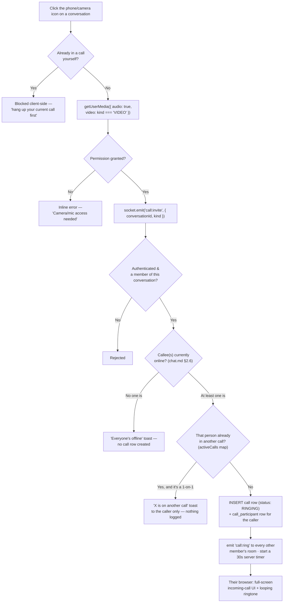
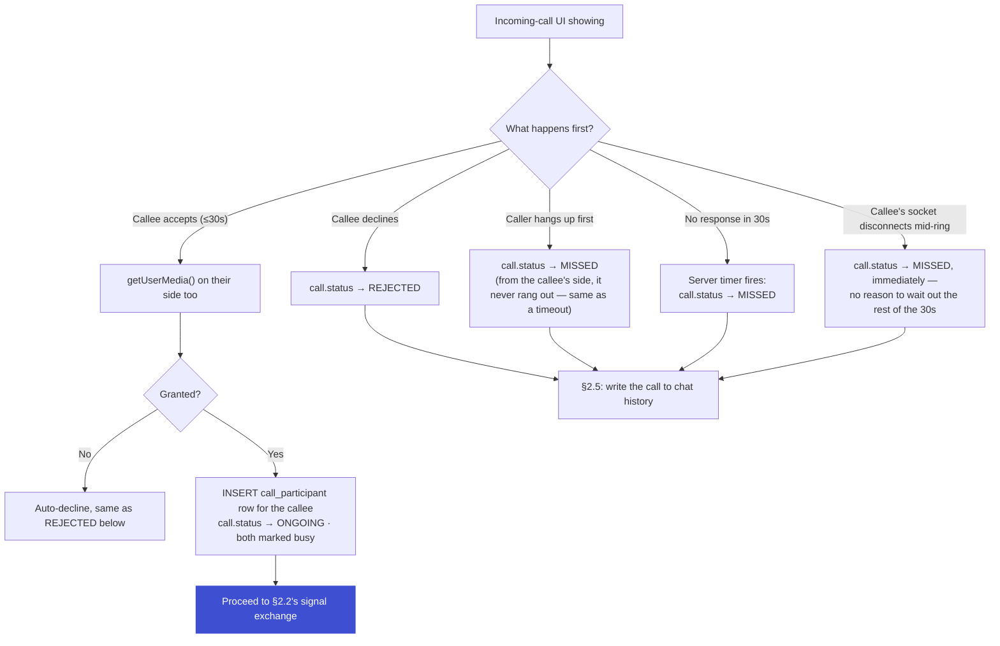
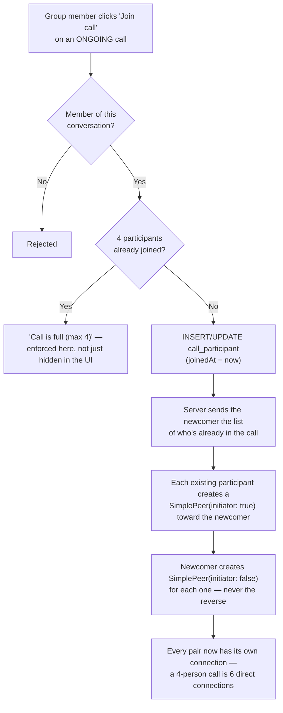

# Calls — Audio & Video on ChatSphere

Picks up after [`chat.md`](../chat/chat.md). A call always belongs to a conversation (`DIRECT` or `GROUP`) and reuses everything chat already built: the same authenticated Socket.IO connection and handshake (chat.md §2.1), the same room-per-conversation model, and the same rule that the server — never the client — decides who's allowed to do what.

**One doc, not two.** Audio and video are the same flow with one flag: `kind: 'AUDIO' | 'VIDEO'` only changes whether `getUserMedia` asks for a camera. Ringing, accept/reject, group joining, busy handling, and call history in chat are identical either way — same reasoning chat.md used to cover DMs and groups in one place instead of splitting them.

---

## 1. Tech Stack

| Layer | What we use |
|---|---|
| **Frontend** | Next.js · `simple-peer` (wraps `RTCPeerConnection` — see note below) · the one shared `socket.io-client` connection from chat.md §2.1, reused as the signaling channel · `react-toastify` (reuse, for "offline" / "busy" / missed-call toasts) |
| **Realtime backend** | The same Socket.IO server from chat.md §3 (`server/`, port `4000`) — one new handler file, no new process, no new port |
| **Media (the actual audio/video)** | WebRTC, built into every browser, peer-to-peer — video and audio frames never touch our server, only the small setup messages do |
| **Database** | Neon (serverless Postgres) · Drizzle ORM — same instance as every other doc |
| **Rate limiting** | Same in-memory `Map` pattern as chat.md §7 — one server, no Redis needed yet |

**Already available to build on:** `user.isOnline` (chat.md §2.6) tells us whether it's even worth ringing someone, and the membership-check pattern from chat.md §2.4 (`SMember`) is reused as-is — you can only call into a conversation you actually belong to.

### Why `simple-peer` and not raw `RTCPeerConnection`

Raw WebRTC makes you branch your code by role: the caller calls `createOffer()`, the callee calls `createAnswer()`, and both sides separately forward `icecandidate` events — three different message shapes to relay. `simple-peer` collapses all of that into one event, `signal`, and one method, `.signal(data)`: whatever blob it hands you next — offer, answer, or ICE candidate — you just forward it over the socket, and whatever blob arrives from the other side, you just feed it back in. One code path handles both roles.

That matters most in §2.4 (group calls): in a mesh, you're simultaneously the *offerer* to someone who just joined and the *answerer* to everyone already there. Raw WebRTC means two different code branches for the same moment; `simple-peer` means the same eight lines regardless of which role a given connection is playing.

**Considered and rejected:** `PeerJS` — does the same wrapping, but ships its own hosted signaling server by default. We already run an authenticated Socket.IO server (chat.md §2.1 is the whole reason it can verify who's calling whom); adding a second signaling path would be a redundant moving part, the same reasoning auth.md used to pick a self-hosted auth library over a hosted one.

---

## 2. The Flow

### 2.1 Before you dial — presence & busy checks



The busy check only hard-blocks a **1-on-1** call — a group call still rings everyone even if one member is on another call; that person simply can't join until they hang up (§2.4 covers what a full or partly-busy group call looks like). Checking `isOnline` before creating anything means a call to someone who's simply not connected costs one query, not a wasted 30-second timer and a phantom row.

### 2.2 The WebRTC handshake — signal relay

Once someone accepts (§2.3), both sides create a `SimplePeer` instance and exchange whatever it hands them, through the server, without the server ever looking inside:

```
Caller: peer = new SimplePeer({ initiator: true, stream: myStream })
Callee: peer = new SimplePeer({ initiator: false, stream: myStream })

peer.on('signal', data => socket.emit('rtc:signal', { to: otherUserId, callId, data }))
   → server relays it verbatim to room user:<to>, nothing stored, nothing inspected
On receiving rtc:signal → peer.signal(data)

peer.on('stream', remoteStream => attach it to the <video>/<audio> element)
peer.on('connect')  → data channel ready (unused today, free for later)
peer.on('close')    → treat exactly like the other side hanging up (§2.5)
```

The server's only job here is **relay** — same principle as message delivery in chat.md, just carrying a different payload. It checks one thing before forwarding: is the sender actually a participant in this `callId`? Nothing else needs validating; the SDP/ICE content is opaque to us on purpose.

### 2.3 Answering, declining, or letting it ring out



**Why cancel-before-pickup and a real timeout both land on `MISSED`:** from the person who didn't answer, both look identical — their phone rang and stopped. Splitting them into separate statuses would only serve the caller's side of the UI, so the DB doesn't bother; §2.5 shows the one place the two are told apart, purely in wording, not in a new status.

### 2.4 Group calls — joining one already in progress



**The rule that prevents collisions:** *whoever was already in the call makes the offer to the newcomer.* If both sides could offer at once, two connections could form and race. Fixing the direction by "who arrived first" means there's never a moment where both sides are guessing what the other will do.

Mesh means everyone uploads their own video separately to everyone else — the 4-person cap exists because a 5th person means every participant is now pushing and pulling five separate video streams, which is a real bandwidth and battery cost, not an arbitrary number:

```
3 people = 3 connections total        4 people = 6 connections total (our cap)

     A                                      A ─── B
    ╱ ╲                                     │ ╲ ╱ │
   B ── C                                   │  ╳  │
                                             │ ╱ ╲ │
                                             C ─── D
```

### 2.5 Hanging up & call history in chat

```
Either side clicks "hang up" (or their peer.on('close') fires)
   → UPDATE call_participant SET leftAt = now() for that person
   → last participant leaving flips call.status → ENDED, endedAt = now()
   → INSERT one message row: type CALL, callId = <this call>
   → same four-layer notification as any message (chat.md §6 / §6 below)
```

**One new message type, not a parallel system.** chat.md §4 already gives `message.type` five values (`TEXT / IMAGE / VIDEO / FILE / SYSTEM`); this doc adds a sixth, `CALL`, plus one nullable column on `message`: `callId`. A call bubble is then just a message that happens to carry a `callId` instead of a `body` — it sorts into the timeline naturally, drives the same unread badge, and needs zero new notification code. The bubble's text is derived from `call.status` at render time, not stored redundantly:

| `call.status` | What the caller sees | What everyone else sees |
|---|---|---|
| `ENDED` | "Call ended · 3:42" (duration) | same |
| `MISSED` | "No answer" | "Missed audio/video call" |
| `REJECTED` | "Call declined" | "Missed audio/video call" (same wording as above — no need to expose that it was a deliberate decline) |

A **busy** result (§2.1) never reaches this table at all — it's a toast to the caller, nothing is ever written, because nothing ever actually rang.

### 2.6 Mid-call network drop & reconnect

```
peer connection state → 'disconnected'  (wifi blip, laptop sleep, tab backgrounded)
   → UI shows "Reconnecting…" instead of ending the call immediately
   → 8-second grace window: try re-signaling a fresh SimplePeer over the same socket room
   → reconnects within the window  → banner clears, call continues, nothing logged
   → still disconnected after 8s   → treated as a normal hangup (§2.5): ENDED, endedAt = now()
```

The grace window exists because "disconnected" is common and often temporary (a phone momentarily losing signal) — ending the call the instant it happens would make ordinary network flakiness feel like the app is broken.

### 2.7 Mute & camera-off

```
Toggle mute   → stream.getAudioTracks().forEach(t => t.enabled = !t.enabled)
Toggle camera → stream.getVideoTracks().forEach(t => t.enabled = !t.enabled)
```

Purely client-side, no socket event, no renegotiation — flipping `enabled` just makes the track send silence or black frames instead of tearing anything down. The other participant finds out only because the incoming stream goes quiet/dark, or optionally via a tiny `call:mute-state` broadcast if you want a muted-mic icon on their tile (cosmetic only — never trust it for anything that matters).

---

## 3. Realtime Server Shape

Extends chat.md §3's `server/src/` layout with one new handler and one new in-memory map:

```
server/src/
├── index.js
├── socket/              (auth.js, create-io.js, connection.js, session-sweep.js)
├── presence.js
├── active-calls.js     ← Map<userId, callId> — powers the busy check in §2.1, same
│                          single-server assumption as presence.js
└── handlers/
    ├── chat.js
    └── call.js          ← call:invite, call:ring, call:accept/reject/cancel,
                             call:join/leave, rtc:signal
```

`active-calls.js` follows the exact same shape as `presence.js`'s online-users map (chat.md §2.6): entering a call adds the entry, leaving removes it, and it's the one place that would need to move to Redis if this ever ran on more than one server — same honest note chat.md already makes about its own maps.

---

## 4. Database

New tables in `db/schema/call/`, same `text("id").primaryKey()` + barrel `index.js` pattern as `db/schema/chat/` and `db/schema/profile/`.

| Table | Key fields |
|---|---|
| `call` | `id`, `conversationId`, `startedById`, `kind` (`AUDIO` \| `VIDEO`), `status` (`RINGING` \| `ONGOING` \| `ENDED` \| `MISSED` \| `REJECTED`), `startedAt`, `endedAt` |
| `call_participant` | `callId`, `userId`, `joinedAt` (null until they actually pick up/join), `leftAt` — composite PK on `(callId, userId)` |

Plus one change to chat.md §4's `message` table: `type` gains a `CALL` value, and a new nullable `callId` column (references `call.id`) is added.

Indexes that matter: `(conversationId, startedAt)` on `call` — same "newest first" access pattern chat.md's `message` index serves, this time for "has this conversation had any recent calls." `call_participant`'s composite PK already covers "who's in call X" and, combined with a `(userId)` index, "is this person in any call right now" for the busy check.

**Why `call_participant` exists even for 1-on-1 calls, where it's always exactly two rows:** it's what makes a *group* call's per-person missed/joined history possible without a second table later — someone invited to a group call who never joins gets a row with `joinedAt: null`, same shape as everyone who did join, no special case in the query that renders it.

---

## 5. Call Rules & Limits

| Setting | Value | Why |
|---|---|---|
| Ring timeout | 30 seconds → `MISSED` | Long enough to grab your phone from another room, short enough that the caller isn't left staring at a spinner |
| Group call cap | 4 joined participants, server-enforced | The mesh bandwidth math in §2.4 — a 5th person makes everyone's connection count jump from 3 to 4 |
| Reconnect grace window | 8 seconds of `disconnected` before ending the call | Covers ordinary wifi flakiness without letting a truly dead connection hang forever |
| Max call duration | None | Calls end when a participant ends them, not on a clock |

---

## 6. Notifications

Same four layers as chat.md §6, but an **incoming call is the one place we go past a toast** — it's the only event in the app that owns the whole screen and loops a sound until it's answered, exactly like a phone call should feel:

```
call:ring arrives
   → full-screen modal + looping ringtone, regardless of what tab/page you're on
   → answered or declined → modal closes, ringtone stops

Call ends (§2.5) → the resulting CALL message goes through chat.md §6's
                    normal pipeline: viewing that conversation right now?
                       YES → render only, no noise
                       NO  → badge + toast + sound (+ tab title if hidden)
```

---

## 7. Rate Limits

| Action | Limit |
|---|---|
| Start a call (`call:invite`) | 15 / hour per user |
| Join a group call (`call:join`) | Not rate-limited — the 4-participant cap (§5) is the real gate here |
| Signal relay (`rtc:signal`) | Not rate-limited — ICE candidates trickle in by design; gated instead on "must be a participant in this `callId`," same principle as chat.md §2.4's membership check |
| Mute / camera toggle | Not rate-limited — never leaves the browser, the server never sees it |

---

## 8. Errors & Failure States

| Scenario | What happens |
|---|---|
| Callee is offline | Immediate "X is offline" toast, no call row created, no ring shown (§2.1) |
| Callee already on another 1-on-1 call | Immediate "X is on another call" toast to the caller only, nothing logged (§2.1) |
| Caller already on another call | Blocked client-side before `call:invite` is even sent |
| Camera/mic permission denied | Inline error, call never starts; same rejection path as a decline if it happens after answering |
| Caller/callee not a member of the conversation | Rejected server-side — same principle as chat.md §2.4's membership check, never trust the client's claimed conversation |
| Group call already has 4 joined participants | 5th `call:join` rejected with "Call is full (max 4)," enforced server-side (§2.4) |
| No response within 30 seconds | `MISSED` for the callee, "No answer" shown to the caller (§2.3) |
| Callee's socket disconnects while still ringing | `MISSED` immediately, no need to wait out the rest of the timer |
| ICE never finds a working path (strict firewall, symmetric NAT, no TURN configured) | Connection attempt times out after ~20s, "Couldn't connect — check your network," logged `ENDED` |
| A `rtc:signal` arrives for a call that already ended | Dropped silently — the receiving side's peer connection no longer exists to feed it into |

---

## 9. Future Work — Not Built Yet

**TURN server.** STUN alone (same setup as everything else here) fails for roughly 10–15% of real-world networks — strict corporate firewalls, symmetric NAT, some mobile carriers. The fix is a relay server (self-hosted `coturn`, or a paid provider) added purely as config — no code here changes, just one more entry in the ICE server list.

**An SFU, for more than 4 people.** Mesh's per-person connection count is what caps this doc at 4 (§2.4). Going higher means each person uploads once and a media server (mediasoup, LiveKit) fans it out — a genuinely separate project, not a tweak to this one.

**Screen sharing.** `getDisplayMedia()` swapped in as an extra or replacement track — the mechanism is small, but it isn't attempted anywhere in this doc yet.

**Call recording / transcription.** Needs consent UX and either server-side media mixing or a client-side `MediaRecorder`, plus storage — out of scope until there's a real request for it.

**Push notifications for calls when the tab is closed.** Same Web Push gap chat.md §9 already flags for messages — a call is the single strongest case for eventually building it, since a missed call is easy to miss twice.

**Background blur / virtual backgrounds.** A pure client-side video-processing feature (e.g. `MediaPipe`), independent of everything else in this doc — nice-to-have polish, not core.
