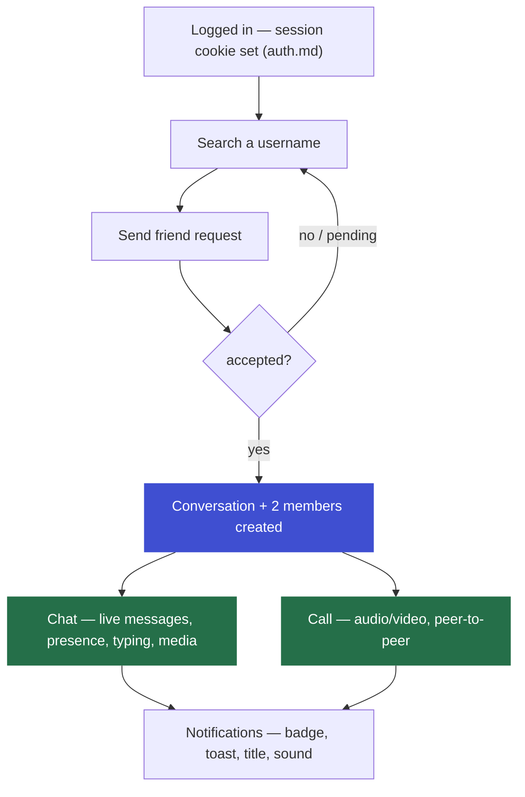
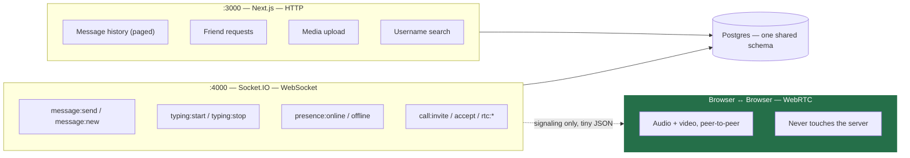
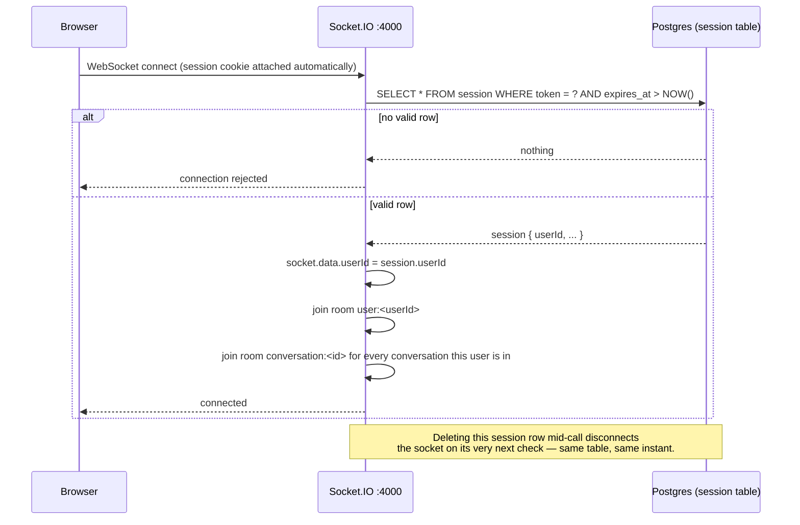
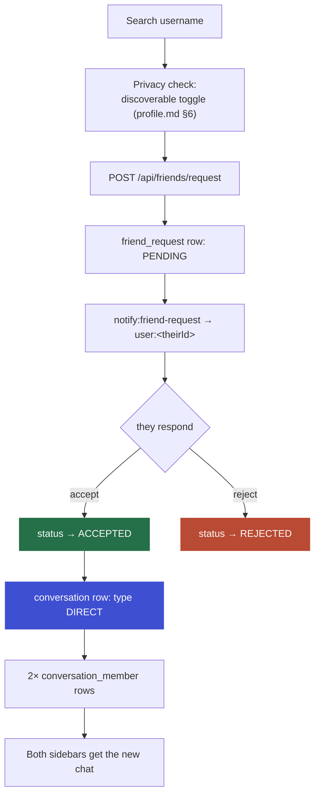
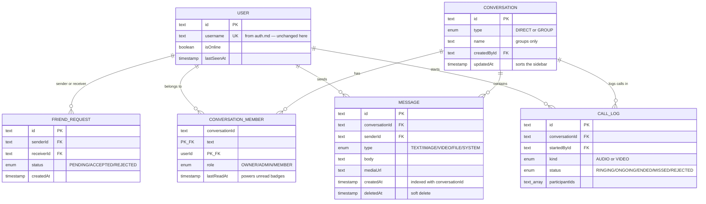
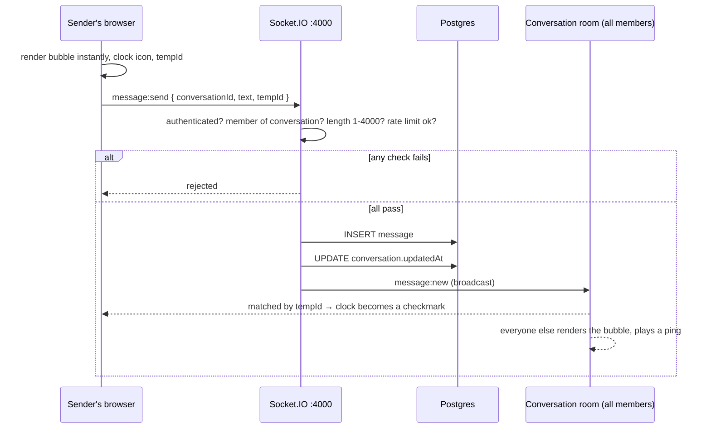
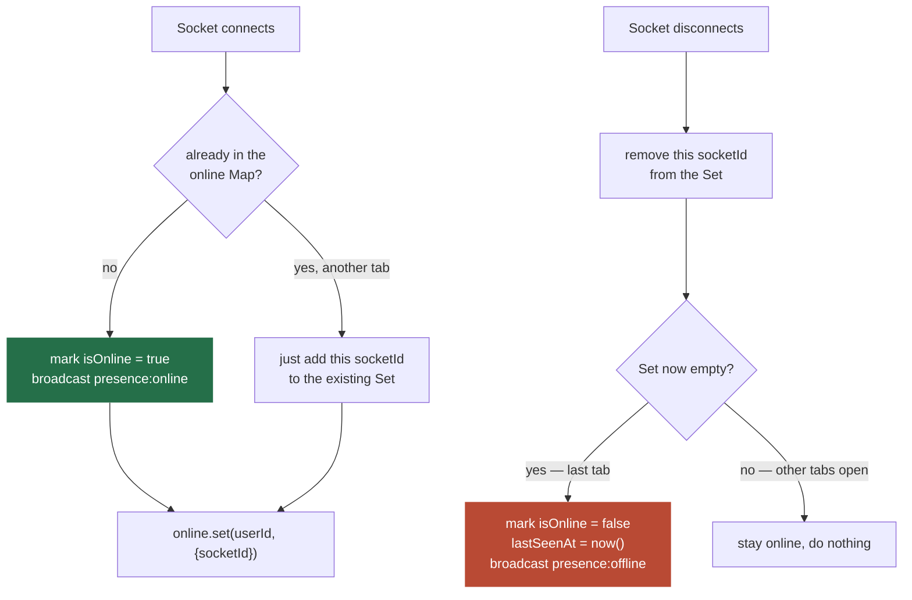
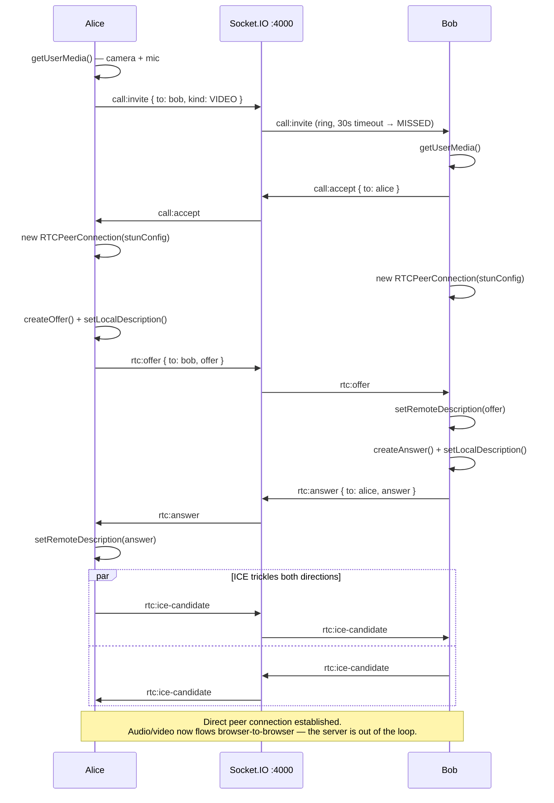
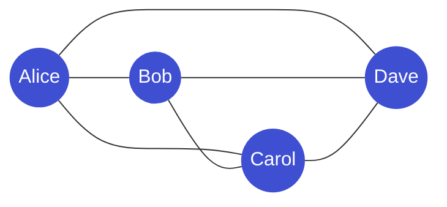

# System Map — Chat & Calling

A visual companion to [`chat.md`](./chat.md), the same way [`system-map.md`](./system-map.md) is a companion to `auth.md` and `profile.md`. `chat.md` is the source of truth; this one just draws the pictures. If a diagram here and the prose there ever disagree, the prose wins — update this file.

**Status:** every diagram below is the target design. None of this is built yet — see `chat.md`'s opening note for what that means.

---

## Table of Contents

1. [The Whole Thing at a Glance](#1-the-whole-thing-at-a-glance)
2. [Three Transports, One App](#2-three-transports-one-app)
3. [The Socket Handshake](#3-the-socket-handshake)
4. [Friend Request → Conversation](#4-friend-request--conversation)
5. [The Chat & Call Schema](#5-the-chat--call-schema)
6. [Sending a Message](#6-sending-a-message)
7. [Presence & the Multi-Tab Problem](#7-presence--the-multi-tab-problem)
8. [The WebRTC Call Handshake](#8-the-webrtc-call-handshake)
9. [Group Call Mesh Topology](#9-group-call-mesh-topology)

---

## 1. The Whole Thing at a Glance

Discovery is deliberately narrow — a username search and a friend request, nothing browsable. Everything below this line only happens between two accounts that already agreed to talk (chat.md §4).

---

## 2. Three Transports, One App

The server's only role in a call is the dotted line — introducing two browsers. Everything solid inside `RTC` never routes through `:3000` or `:4000` (chat.md §2, §11).

---

## 3. The Socket Handshake

The socket server has no login of its own — it reads the exact `session` row Better Auth already wrote (auth.md §7, chat.md §3).

---

## 4. Friend Request → Conversation

One `friend_request` row serves as both the pending request and, once `ACCEPTED`, the friendship itself — there is no separate `friendship` table (chat.md §4).

---

## 5. The Chat & Call Schema

None of these tables exist in `db/schema/` yet — they'd live in a new `db/schema/chat/` folder, referencing the real `user` table the same way `db/schema/profile/*` already does (chat.md §5).

`conversation_member` cascade-deletes with both `user` and `conversation`. The composite index on `message(conversationId, createdAt)` is the single most important index in the app — every chat open runs that exact query (chat.md §5).

---

## 6. Sending a Message

The membership check is not optional — without it, anyone who learns a `conversationId` could post into a conversation they were never added to (chat.md §6).

---

## 7. Presence & the Multi-Tab Problem

The `Map` lives in the Socket.IO process's memory. It's exactly correct with one server; a second server process would need this moved to Redis (chat.md §7, §13).

---

## 8. The WebRTC Call Handshake

Ten steps, one handshake, repeated for every call — signaling rides the same socket connection from §3; the media itself never does.

---

## 9. Group Call Mesh Topology

4 people, 6 direct connections, each uploading a separate copy of their stream to every other participant — the arithmetic behind the server-enforced cap of 4 (chat.md §12). A 5th `call:join` is rejected by the server, not just hidden by the UI.
