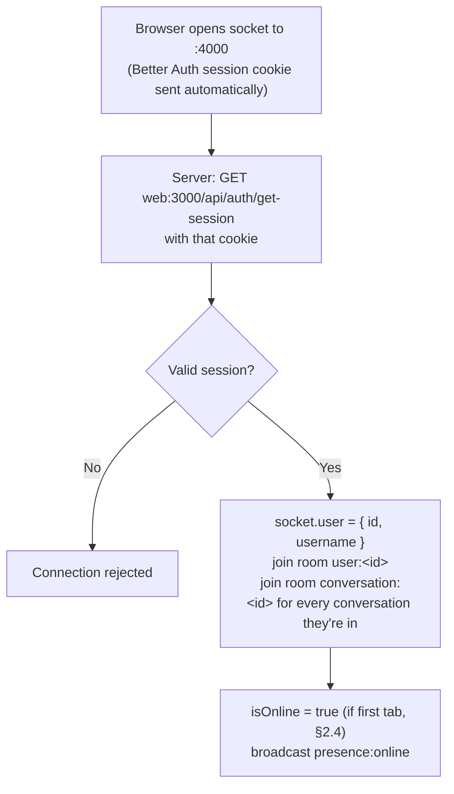
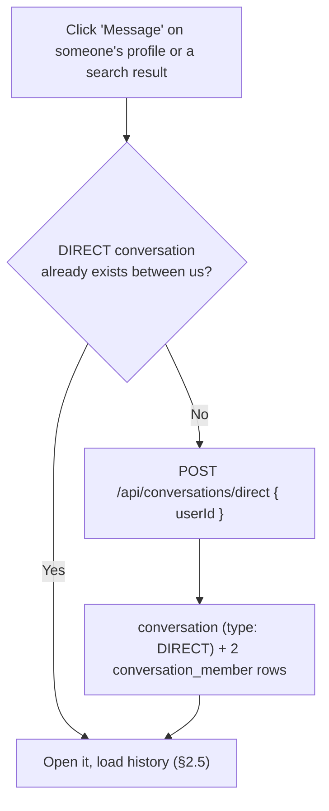
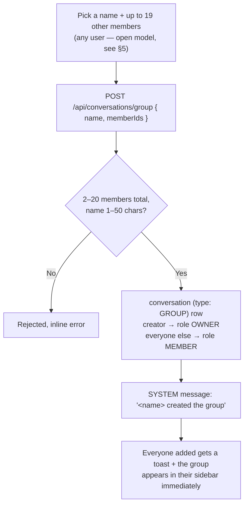
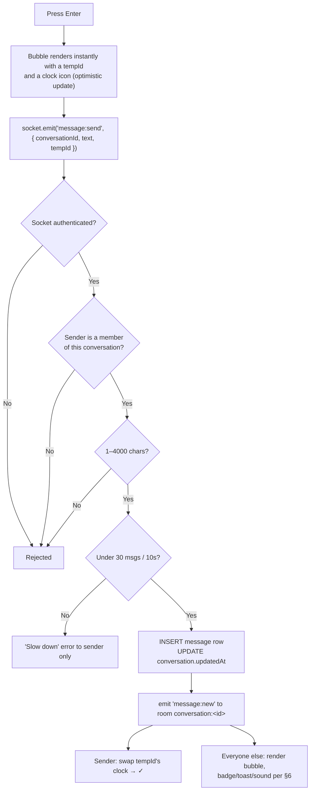

# Chat — Direct Messages & Groups on ChatSphere

Picks up after [`profile.md`](./profile.md). This is the first thing built on the **second server** — `server/`, the Socket.IO real-time server described in the root [`README.md`](../../README.md) §4, on port 4000.

**Messaging model: open DMs.** Per `profile.md` §"No relationship graph yet," there is no Follow/Friend system built. Any user can message any other user directly — no request, no acceptance step. `privacy_settings.friendRequests` and the `FRIENDS` / `FRIENDS_OF_FRIENDS` audience tiers already exist as columns (`db/schema/auth/index.js` → `privacy-settings.js`) but are inert until a relationship graph exists (`profile.md` §7) — chat treats them as `EVERYONE` for now. When Follow/Friend ships, the upgrade is a single new gate check in `startConversation`, nothing in this doc's data model changes.

**Groups build on the same model.** Nothing gates who a `MEMBER`/`ADMIN`/`OWNER` can add to a group either — see §5 for why that's a real spam surface at this stage and what's deliberately deferred.

---

## 1. Tech Stack

| Layer | What we use |
|---|---|
| **Frontend** | Next.js · `socket.io-client` (one shared connection per tab, see §2.1) · `react-toastify` (reuse from auth.md §1, for message toasts) |
| **Realtime backend** | Node.js + Express + `socket.io` — a **separate process** from the Next.js app (`server/`, port `4000`), per README §4. Talks to Next.js once per socket connection to resolve the Better Auth session cookie (§2.1) |
| **Media (chat)** | Cloudinary — same SDK and pattern as `profile.md`'s avatar pipeline (`sharp` real-format check, EXIF strip), new folder/preset for message attachments |
| **Database** | Neon (serverless Postgres) · Drizzle ORM — same instance as auth.md / profile.md |
| **Rate limiting** | In-memory `Map`, same reasoning as README §8.3/8.5 — one server, so no Redis needed yet (README §13.1 is the documented upgrade path) |

**Already available to build on:** `user.isOnline` / `user.lastSeenAt` (presence columns already exist in `db/schema/auth/user.js`) and `privacy_settings.onlineStatus` (audience gate on who sees them) — chat doesn't need to add either, just read and update them.

---

## 2. The Flow

### 2.1 Connecting — how the socket server knows who you are



Same handshake as README §4 — one internal HTTP round-trip per connection (~5ms), not a shared JWT secret. Every event on that socket is now known to belong to that user; the client can never claim to be someone else.

### 2.2 Starting a conversation (open DM)



No accept/reject step — this is the direct consequence of the open-DM model. The only server-side gate is `discoverable` (profile.md §3) — you can't start a DM with someone whose privacy setting hides them from you in the first place, same rule search already applies.

### 2.3 Creating a group



Members are added directly, not invited — consistent with the open-DM model (there's no relationship to check). §5 covers why this is flagged as a near-term follow-up, not a launch blocker.

### 2.4 Sending a message



Membership check (`SMember`) is the one line that matters most in this whole doc: without it, anyone who learns a `conversationId` could post into a conversation they were never added to. Never trust the client's claim about which room it's in — same principle as README §8.3.

### 2.5 Loading history & unread state

```
Open a conversation
   → HTTP GET /api/conversations/:id/messages?before=<cursor>&limit=30
   → cursor-paginated by (createdAt, id), newest 30 first, scroll up for older
   → on open: conversation_member.lastReadAt = now()  (powers the unread badge, §4)
```

Live messages arrive over the socket; history is a bulk HTTP fetch — same split as README §5.

### 2.6 Presence & typing

```
Socket connects   → isOnline = true  → broadcast presence:online   (only if onlineStatus allows the viewer, per privacy_settings)
                  → the connecting socket also receives presence:snapshot — the co-members
                    already online (privacy-filtered, online-only). Transition broadcasts
                    can't reach a socket that wasn't connected when they fired.
Socket disconnects → isOnline = false, lastSeenAt = now() → broadcast presence:offline

You type       → socket.emit('typing:start') → relayed to the conversation room
You pause 2s   → socket.emit('typing:stop')
```

Typing state is never persisted — meaningless a second later, same as README §8.4.

**Multi-tab:** presence uses the same in-memory `Map<userId, Set<socketId>>` counter as README §8.4 — first tab connecting flips you online, last tab disconnecting flips you offline. This lives in `server/src/services/presence.js`; it's the documented single-server assumption, see README §13.1 for the Redis upgrade path.

**Privacy:** `presence:*` events and `lastSeenAt` in any API response are filtered server-side by the recipient's `privacy_settings.onlineStatus` before they leave the server — never hidden client-side only (profile.md §1's rule: "enforced in the API, never in the UI").

### 2.7 Sending media in chat

Same pipeline as profile.md's avatar upload, different bucket:

```
Pick file → client-side size/type check (courtesy only)
   → POST /api/upload/chat-media  (multipart)
   → SERVER: logged in? member of the target conversation? sharp confirms real
     format (image/video/file/audio, size caps in §4)? rate limit (10/min, profile.md-style)?
   → Cloudinary upload → { url, mime, size }
   → socket.emit('message:send', { type: 'IMAGE'|'VIDEO'|'FILE', mediaUrl, ... })
   → same path as §2.4 from here
```

**Voice notes — BUILT (2026-08-19).** A fourth media kind, `AUDIO`, riding this exact
pipeline with three deltas:

- **Recorder-only in the UI.** The composer's mic button records via `MediaRecorder`
  (tap to start; strip with timer, cancel and send; 2-minute auto-stop that keeps the
  take sendable). The composer's file picker offers no audio kinds and a picked `.mp3`
  is rejected by the sniff allowlist — but a picked/direct-POSTed `.ogg` DOES become an
  AUDIO message (OggS is the one container that sniffs unambiguously to audio), and is
  subject to the same server-enforced 2-minute bound as a recording.
- **The upload declares intent.** An audio-only webm/mp4 is byte-identical to a video
  in the same container, so the recorder sends `voice: "1"` and the route re-types an
  allowlisted A/V container to `AUDIO` + `audio/*` mime (anything else marked voice is
  a 400). Caps: 5MB, and a server-enforced 2-minute duration bound checked against
  Cloudinary's probe (+2s recorder-jitter slack) on every AUDIO upload — the client's
  auto-stop is advisory. Uploaded as Cloudinary resource_type `video`, which is what
  probes the bytes and returns the duration.
- **`message.media_duration_ms`** stores that probed duration (never the client's
  stopwatch) — load-bearing for playback, because Chrome's MediaRecorder writes webm
  with no duration header and the `<audio>` element reports `Infinity`. The bubble is
  a compact custom player (play/pause, seek, elapsed/total); one note plays at a time.

---

## 3. Realtime Server Shape

```
server/src/
├── index.js            ← entrypoint: Express app + /healthz, http.Server, wiring, shutdown
├── config/
│   ├── env.js          ← config, validated first (db/ reads DATABASE_URL at module load)
│   └── db.js           ← the one require("../../../db") bridge to the shared schema
├── services/
│   ├── rooms.js        ← room naming + membership (the authorization primitive)
│   ├── presence.js     ← online-users Map, privacy memo, is_online/last_seen writes (§2.6)
│   ├── rate-limit.js   ← in-memory fixed-window limiter + LIMITS table (§7)
│   └── media-token.js  ← HMAC verifier, mirrors web/src/lib/chat/media-token.ts (§8)
├── middlewares/
│   └── auth.js         ← the handshake in §2.1 — verifies the session cookie once per connection
├── socket/
│   ├── create-io.js    ← Server options, CORS/allowRequest, handshake middleware
│   ├── connection.js   ← connection/disconnecting lifecycle
│   └── session-sweep.js← 5-minute session revalidation
├── routes/
│   └── internal.js     ← POST /internal/events, the Next → socket bridge (§2.1)
└── controllers/
    ├── shared.js        ← fail/serializeMessage/sendIsBlocked, shared by chat + call
    ├── notify.js        ← fan-out for toasts/badges (§6)
    └── chat/            ← one module per concern, registered by its index.js
        ├── send.js  delete.js  edit.js  receipts.js  typing.js
        └── shared.js    ← chat-only constants (NOT_FOUND/BLOCKED, max length)
```

CORS on the Socket.IO server is locked to the web app's origin only, per README §12's production checklist.

---

## 4. Database

New tables, all in `db/schema/chat/`, following the same `text("id").primaryKey()` + per-domain `index.js` barrel pattern as `db/schema/auth` and `db/schema/profile`.

| Table | Key fields |
|---|---|
| `conversation` | `id`, `type` (`DIRECT` \| `GROUP`), `name` (groups only), `avatarUrl` (groups only, Cloudinary), `createdById`, `createdAt`, `updatedAt` (bumped on every message — sorts the sidebar) |
| `conversation_member` | `conversationId`, `userId`, `role` (`OWNER` \| `ADMIN` \| `MEMBER`), `joinedAt`, `lastReadAt` — composite PK on `(conversationId, userId)` |
| `message` | `id`, `conversationId`, `senderId`, `type` (`TEXT` \| `IMAGE` \| `VIDEO` \| `FILE` \| `AUDIO` \| `SYSTEM` \| `CALL`), `body`, `mediaUrl`, `mediaMime`, `mediaSize`, `mediaName`, `mediaDurationMs`, `createdAt`, `deletedAt` (soft delete) |

Indexes that matter: `(conversationId, createdAt)` on `message` — every chat open runs "newest 30 in conversation X"; `(userId)` on `conversation_member` — "list all my chats." Both called out explicitly because README §6 flags them as the ones that turn a 1ms query into a full table scan if forgotten.

**Unread counts** come from `lastReadAt`, not a per-message read-receipt table.

**Read receipts are BUILT (2026-08-18), and still with no receipt table.** The original trade-off above assumed "count, not ticks" were the only two options. They are not: a second watermark, `conversation_member.lastDeliveredAt`, makes a message *delivered to X* iff `X.lastDeliveredAt >= message.createdAt`, and *read by X* the same way against `lastReadAt`. Two timestamps per member encode the state of every message they will ever receive, so per-message ticks and group "seen by" cost **zero rows per message** — the extra writes this section was avoiding never materialised.

Two consequences worth knowing:
- `conversation:read` now broadcasts to the conversation room (`conversation:read-by`) as well as to the reader's own tabs, which earlier versions of this doc explicitly ruled out.
- Both broadcasts are gated server-side on the reader's `privacy_settings.onlineStatus`. A read timestamp is strictly more revealing than "online", so anyone who hides their presence emits neither. Decided on the server and never sent, per §2.6 — never sent and hidden by the client.

**DM vs. group, one table:** a DIRECT conversation is a GROUP-shaped row with exactly 2 members and no name — chat rendering, sending, and history loading are written once, not twice. Directly reused from README §6.

---

## 5. Group Membership — the one open question worth flagging

Because there's no Follow/Friend graph, a `MEMBER`/`ADMIN`/`OWNER` can add **any** user to a group directly, with no invite/accept step. That's consistent with open DMs, but it's a real spam surface the moment this has more than a handful of trusted users — someone could add a stranger to a group repeatedly.

**What's shipping now (MVP, matches the "don't build for scale you don't have" philosophy):** direct-add, `Leave Group` always available, group creation rate-limited (§7).

**What's deliberately not built, and why it's fine to defer:** a `Block` feature and a "who can add me to groups" privacy gate (the natural `groupInvites` sibling to `privacy_settings.friendRequests`). Neither is hard, but neither matters until there are enough users that spam-adding is a real annoyance rather than a hypothetical. Flagging it here so it doesn't get forgotten — recommend building `Block` before this goes past a handful of trusted testers.

---

## 6. Notifications (cross-cutting, reused by calls later)

Same four layers as README §8.6 — unread badge (`COUNT WHERE createdAt > lastReadAt`), toast, tab-title blink, sound — gated on whether the recipient is currently looking at that conversation:

```
message:new arrives
   → viewing this conversation right now?  YES → render only, mark read, no noise
                                             NO  → badge + toast + sound (+ tab title if hidden)
```

No Web Push (needs a service worker + VAPID + permission prompt) — README §13.6 territory, not this phase.

---

## 7. Rate Limits

| Action | Limit |
|---|---|
| Send message | 30 / 10 seconds per user |
| Start a DM | 20 / hour per user (spam-conversation guard) |
| Create a group | 5 / day per user |
| Upload chat media | 10 / minute per user |
| Mark-as-read ping | not rate limited — cheap, idempotent |

---

## 8. Errors & Failure States

| Scenario | What happens |
|---|---|
| Message to a conversation you're not a member of | Rejected server-side, never trust the client's claimed room (§2.4) |
| Message >4000 chars or empty | Rejected, inline error |
| Rate limit exceeded (messages or uploads) | Error to sender only, others unaffected |
| Media: wrong real format / fake extension | Rejected — `sharp` reads actual bytes, same as profile.md avatar check |
| Media over size cap (image 5MB / video 20MB / file 10MB / audio 5MB) | Rejected, inline error |
| Group: <2 or >20 members, or name >50 chars | Rejected, inline error |
| Starting a DM with someone who's set `discoverable: NOBODY`/restricted against you | Same non-committal failure as search already gives (profile.md-consistent) |
| Socket disconnects mid-send | Client keeps the tempId bubble with a retry affordance; no silent message loss |

---

## 9. Future Work — Not Built Yet

**Friend/Follow-gated messaging.** The whole point of designing this as "open DMs, one gate check away from friend-gated" — see the top of this doc and `profile.md` §7. When Follow ships, `startConversation` gains one check; nothing else here changes.

**~~Block & mute.~~ BUILT (2026-08-18).** A `block` table in the new `db/schema/social/` domain, checked in both directions at every gate: DM creation, `message:send` (DIRECT only — one member blocking another must not break a group for everybody), group member-add, and people search. Every gate answers exactly what it would answer for a user who does not exist; none of them says "you are blocked", which would turn the block into a notification. Mute is `conversation_member.mutedUntil`, a timestamp rather than a boolean so "mute for 8 hours" is expressible.

**Message editing — BUILT (2026-08-18).** `message.editedAt`, as this line proposed. TEXT-only, own-messages-only, no time limit, and deliberately does **not** bump `conversation.updatedAt` — an edit to a week-old message must not jump the conversation to the top of everyone's sidebar.

**Message reactions — still not built on `main`.** Built and then deliberately deferred: the whole feature lives on the `feature/message-reactions` branch (a `reaction` table keyed on `(messageId, userId, emoji)`, `reaction:toggle`/`reaction:updated`, a store, a picker and the chips) and was removed from `main` because it isn't needed yet. Bring it back by diffing that branch rather than rebuilding it.

**~~Per-person read receipts.~~ BUILT (2026-08-18)** — see §4, which now records how, and why it turned out to need no new table.

**Full-text search over messages.** `ILIKE` is fine at this scale; Postgres `tsvector` + GIN is the documented upgrade (README §13.5), not needed yet.

**Web Push.** README §13.6 — needs a service worker and a permission prompt; in-app notification (§6) covers a 20-user app where the tab stays open.

**E2EE.** Not attempted — same honest note as README §12: messages are encrypted in transit, readable in the database, same as most non-Signal apps.
