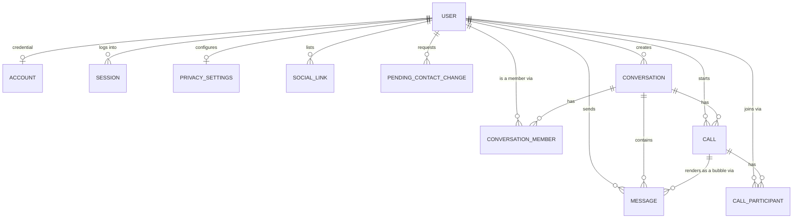

# Database Schema — Table Reference

This is the implemented schema behind every other doc in this repo — [`auth.md`](../user/auth.md), [`profile.md`](../user/profile.md), [`search.md`](../user/search.md), [`chat.md`](../chat/chat.md), [`call.md`](../call/call.md) — built exactly to the folder layout and connection architecture described in [`db-connection.md`](./db-connection.md). Read that doc first for *how* the schema is wired up (barrels, Drizzle Kit, the shared `db` object); this doc is *what* it actually contains.

13 tables, 6 domain enums, across 4 domain folders. Every design decision below that wasn't explicit in the domain docs was confirmed with the project owner before implementation — see [`../../CLAUDE.md`](../../CLAUDE.md) for the full decision log.

---

## 1. Entity Relationship Diagram



`verification` and `pending_registration` are intentionally standalone (identifier/email-keyed, no FK to `user`) — not shown above. See §3.1 and §3.5.

---

## 2. Cross-Cutting Conventions

| Convention | Rule |
|---|---|
| **Primary keys** | `text("id").primaryKey()`, generated app-side via `crypto.randomUUID()` (`node:crypto`) — except junction tables, which use a composite PK instead of a surrogate `id` |
| **Timestamps** | `timestamp(..., { withTimezone: true })` everywhere (Postgres `timestamptz`) |
| **Columns** | snake_case in Postgres, camelCase in Drizzle/JS, always passed as an explicit first-arg string (never relying on Drizzle's name inference) |
| **Enums** | Postgres type names are `snake_case`, suffixed `_enum`; values are `SCREAMING_SNAKE_CASE` |
| **Constraint/index names** | Explicit, not Drizzle's auto-generated defaults — `uq_<table>_<column(s)>` for unique constraints, `idx_<table>_<column(s)>` for indexes |
| **Foreign keys pointing at `user`** | `RESTRICT` on every historical/business-record table (`conversation.createdById`, `conversation_member.userId`, `message.senderId`, `call.startedById`, `call_participant.userId`) — `user` rows are anonymized in place on deletion, never hard-deleted, so this is a guardrail, not an expected code path. `CASCADE` on purely ephemeral/decorative companion rows (`account`, `session`, `social_link`, `privacy_settings`, `pending_contact_change`) that have no independent meaning without their user. |
| **User deletion model** | Soft-scheduled (`user.deletionScheduledAt`), reversible by login within 30 days; a nightly job anonymizes the row in place afterward. Message/call history therefore always resolves to a valid `user` row, even long after "deletion." |

---

## 3. `auth` domain — `db/schema/auth/`

Owns the one table every other domain reads but never redefines: `user`. See [`db-connection.md §4`](./db-connection.md#4-schema-organization--one-barrel-per-domain).

### 3.1 `user`

| Column | Type | Null? | Default | Notes |
|---|---|---|---|---|
| id | text | NOT NULL PK | `randomUUID()` | |
| email | text | NOT NULL | — | unique (`uq_user_email`) |
| email_verified | boolean | NOT NULL | false | |
| name | text | NOT NULL | — | Better Auth core field, not app-facing; computed from first/last name at signup |
| image | text | NULL | — | Better Auth core field, unused — avatars go through `avatar_public_id` instead |
| first_name | text | NOT NULL | — | 1–25 chars |
| last_name | text | NULL | — | 0–25 chars |
| username | text | NOT NULL | — | unique (`uq_user_username`), stored lowercase, 3–30 chars |
| display_username | text | NOT NULL | — | typed case preserved |
| birth_date | date | NOT NULL | — | age ≥13 app-enforced |
| bio | text | NULL | — | 0–250 chars |
| avatar_public_id | text | NULL | — | Cloudinary `public_id` only, never a full URL |
| username_changed_at | timestamptz | NULL | — | drives the 1-change/30-day rule |
| deactivated_at | timestamptz | NULL | — | reversible on login |
| deletion_scheduled_at | timestamptz | NULL | — | `now() + 30d`; login cancels it |
| is_online | boolean | NOT NULL | false | read/written by the realtime server |
| last_seen_at | timestamptz | NULL | — | filtered by `privacy_settings.online_status` before display |
| created_at | timestamptz | NOT NULL | now() | |
| updated_at | timestamptz | NOT NULL | now() | |

No FKs — `user` is the root of the graph. Indexes: unique on `email`, unique on `username` (doubles as the prefix-search index used by [`search.md`](../user/search.md) — no additional index needed).

### 3.2 `account` (Better Auth)

| Column | Type | Null? | Notes |
|---|---|---|---|
| id | text | NOT NULL PK | |
| user_id | text | NOT NULL | FK → `user.id`, **CASCADE** |
| provider_id | text | NOT NULL | e.g. `"credential"` |
| account_id | text | NOT NULL | Better Auth core field; set to the user's own id for the credential provider |
| access_token / refresh_token / id_token | text | NULL | Better Auth core OAuth fields, unused — this app is credential-only, no OAuth providers in scope |
| access_token_expires_at / refresh_token_expires_at | timestamptz | NULL | ditto, unused |
| scope | text | NULL | ditto, unused |
| password | text | NULL | scrypt hash; only set for the credential provider — deliberately kept off `user` |
| created_at / updated_at | timestamptz | NOT NULL | |

Index: `idx_account_user` on `user_id`. The OAuth-shaped columns above exist only because Better Auth's base `account` schema requires them on every row (verified against the installed `better-auth@1.6.28` package's core types, not guessed) — see `CLAUDE.md`'s "Known risk to close out" section for why this reconciliation pass happened.

### 3.3 `session` (Better Auth)

| Column | Type | Null? | Notes |
|---|---|---|---|
| id | text | NOT NULL PK | |
| token | text | NOT NULL | unique (`uq_session_token`) — hot-path lookup on every request |
| user_id | text | NOT NULL | FK → `user.id`, **CASCADE** |
| expires_at | timestamptz | NOT NULL | |
| ip_address / user_agent | text | NULL | |
| created_at / updated_at | timestamptz | NOT NULL | |

Index: `idx_session_user` on `user_id`.

### 3.4 `verification` (Better Auth)

| Column | Type | Null? | Notes |
|---|---|---|---|
| id | text | NOT NULL PK | |
| identifier | text | NOT NULL | e.g. email — indexed (`idx_verification_identifier`) |
| value | text | NOT NULL | the code/token |
| expires_at | timestamptz | NOT NULL | |
| created_at / updated_at | timestamptz | NOT NULL | |

No FK — must work by identifier alone (some flows run before a user is definitively resolved).

### 3.5 `pending_registration`

Ephemeral row backing the signup OTP step. No FK — the whole point is that no `user` row exists yet.

| Column | Type | Null? | Notes |
|---|---|---|---|
| id | text | NOT NULL PK | |
| email | text | NOT NULL | unique (`uq_pending_registration_email`) |
| otp_hash | text | NOT NULL | sha-256 hex |
| attempts | integer | NOT NULL, default 0 | row burns at 3 |
| expires_at | timestamptz | NOT NULL | 5-minute OTP validity window |
| created_at | timestamptz | NOT NULL | |

### 3.6 `rate_limit_hit`

App-level rate-limit counters for the per-email / per-IP limits in `auth.md` (login attempts, signup OTP sends, account creation, forgot-password requests) that Better Auth's own IP+path-keyed limiter can't express. No FK — bucket keys are opaque strings like `login:<email>:<ip>`.

| Column | Type | Null? | Notes |
|---|---|---|---|
| id | text | NOT NULL PK | |
| bucket_key | text | NOT NULL | unique (`uq_rate_limit_hit_bucket_key`) |
| window_start | timestamptz | NOT NULL | start of the current counting window |
| count | integer | NOT NULL, default 1 | hits within the current window |
| created_at | timestamptz | NOT NULL | |

---

## 4. `profile` domain — `db/schema/profile/`

### 4.1 `social_link`

| Column | Type | Null? | Notes |
|---|---|---|---|
| id | text | NOT NULL PK | |
| user_id | text | NOT NULL | FK → `user.id`, **CASCADE** |
| platform | text | NOT NULL | free text |
| url | text | NOT NULL | valid http(s), app-validated |
| created_at | timestamptz | NOT NULL | |

Index: `idx_social_link_user`. Max 4 rows/user — app-enforced, not a DB constraint (per `profile.md`).

### 4.2 `privacy_settings`

1:1 with `user`. **The three audience columns are plain `text`, not a native Postgres enum** — a deliberate choice (see [`../../CLAUDE.md`](../../CLAUDE.md) decision log): `profile.md` says these will soon grow beyond `EVERYONE`/`NOBODY` to include `FRIENDS`/`FRIENDS_OF_FRIENDS` once a `follow` table exists, and native enums need an `ALTER TYPE` to extend — awkward under this project's `drizzle-kit push` workflow. Enforce the allowed-values list at the application layer (e.g. Zod), not in the database.

| Column | Type | Null? | Default | Notes |
|---|---|---|---|---|
| id | text | NOT NULL PK | | |
| user_id | text | NOT NULL | | FK → `user.id`, **CASCADE**, unique (`uq_privacy_settings_user`) |
| discoverable | text | NOT NULL | `'EVERYONE'` | app-validated: `EVERYONE \| NOBODY` today |
| online_status | text | NOT NULL | `'EVERYONE'` | same allowed values |
| profile_details | text | NOT NULL | `'EVERYONE'` | same allowed values |
| created_at / updated_at | timestamptz | NOT NULL | | |

> `chat.md`'s intro references a `privacy_settings.friendRequests` column as if it already existed. `profile.md` — the authoritative doc for this table — never defines it and explicitly states no FRIENDS tier exists yet. **This column is intentionally not implemented.** See the decision log.

### 4.3 `pending_contact_change`

Ephemeral row backing the "change email" flow — same shape/lifecycle as `pending_registration`.

| Column | Type | Null? | Notes |
|---|---|---|---|
| id | text | NOT NULL PK | |
| user_id | text | NOT NULL | FK → `user.id`, **CASCADE** |
| type | `pending_contact_change_type_enum` | NOT NULL | native enum: `EMAIL` (extensible later, e.g. `PHONE`) |
| new_value | text | NOT NULL | |
| otp_hash | text | NOT NULL | |
| attempts | integer | NOT NULL, default 0 | |
| expires_at | timestamptz | NOT NULL | 5-minute TTL |
| created_at | timestamptz | NOT NULL | |

Index: `idx_pending_contact_change_user`.

---

## 5. `chat` domain — `db/schema/chat/`

### 5.1 `conversation`

A DIRECT conversation is just a 2-member GROUP-shaped row with no `name` — one table, no separate DM model (per `chat.md`).

| Column | Type | Null? | Default | Notes |
|---|---|---|---|---|
| id | text | NOT NULL PK | | |
| type | `conversation_type_enum` | NOT NULL | | `DIRECT \| GROUP` |
| name | text | NULL | | groups only, 1–50 chars |
| avatar_url | text | NULL | | groups only |
| created_by_id | text | NOT NULL | | FK → `user.id`, **RESTRICT** |
| created_at / updated_at | timestamptz | NOT NULL | now() | `updated_at` bumped on every new message |

Index: `idx_conversation_updated_at` — drives sidebar sort order.

### 5.2 `conversation_member`

Junction table — **composite primary key** `(conversation_id, user_id)`, no surrogate `id`.

| Column | Type | Null? | Default | Notes |
|---|---|---|---|---|
| conversation_id | text | NOT NULL | | FK → `conversation.id`, **CASCADE**, part of PK |
| user_id | text | NOT NULL | | FK → `user.id`, **RESTRICT**, part of PK |
| role | `conversation_role_enum` | NOT NULL | `'MEMBER'` | `OWNER \| ADMIN \| MEMBER` |
| joined_at | timestamptz | NOT NULL | now() | |
| last_read_at | timestamptz | NULL | | unread counts derive from this — no per-message read-receipt table |

Index: `idx_conversation_member_user` on `user_id` alone — required because the composite PK is only efficiently searchable by its leading column (`conversation_id`); "list my conversations" needs its own index.

### 5.3 `message`

| Column | Type | Null? | Default | Notes |
|---|---|---|---|---|
| id | text | NOT NULL PK | | |
| conversation_id | text | NOT NULL | | FK → `conversation.id`, **CASCADE** |
| sender_id | text | NOT NULL | | FK → `user.id`, **RESTRICT** — always points at a valid (possibly anonymized) `user` row; never made nullable to "handle" user removal |
| type | `message_type_enum` | NOT NULL | `'TEXT'` | `TEXT \| IMAGE \| VIDEO \| FILE \| SYSTEM \| CALL` |
| body | text | NULL | | TEXT type, 1–4000 chars app-validated |
| media_url / media_mime / media_name | text | NULL | | IMAGE / VIDEO / FILE types |
| media_size | integer | NULL | | bytes |
| call_id | text | NULL | | FK → `call.id`, **SET NULL** — CALL type only; bubble text is derived from `call.status` at render time, never stored redundantly |
| created_at | timestamptz | NOT NULL | now() | |
| deleted_at | timestamptz | NULL | | soft delete |

Indexes: `idx_message_conversation_created_at` on `(conversation_id, created_at)` — required for cursor-paginated history (30/page); `idx_message_call` on `call_id` — cheap addition for fast "find the message for this call" lookups.

---

## 6. `call` domain — `db/schema/call/`

### 6.1 `call`

| Column | Type | Null? | Default | Notes |
|---|---|---|---|---|
| id | text | NOT NULL PK | | |
| conversation_id | text | NOT NULL | | FK → `conversation.id`, **CASCADE** |
| started_by_id | text | NOT NULL | | FK → `user.id`, **RESTRICT** |
| kind | `call_kind_enum` | NOT NULL | | `AUDIO \| VIDEO` |
| status | `call_status_enum` | NOT NULL | `'RINGING'` | `RINGING \| ONGOING \| ENDED \| MISSED \| REJECTED` |
| started_at | timestamptz | NOT NULL | now() | |
| ended_at | timestamptz | NULL | | |

Index: `idx_call_conversation_started_at` on `(conversation_id, started_at)`.

A "busy" result on a 1:1 call is **never written here** — toast only, no row. Several distinct causes (early hangup, 30s ring timeout, callee disconnect mid-ring) all collapse into `MISSED` — the UI wording differs per side, not the DB state.

### 6.2 `call_participant`

Junction table — **composite primary key** `(call_id, user_id)`, no surrogate `id`.

| Column | Type | Null? | Notes |
|---|---|---|---|
| call_id | text | NOT NULL | FK → `call.id`, **CASCADE**, part of PK |
| user_id | text | NOT NULL | FK → `user.id`, **RESTRICT**, part of PK |
| joined_at | timestamptz | NULL | stays null until they actually pick up/join |
| left_at | timestamptz | NULL | |

Index: `idx_call_participant_user` on `user_id` alone — required for the busy-check query (`WHERE user_id = ? AND joined_at IS NOT NULL AND left_at IS NULL`), which the composite PK (leading on `call_id`) can't serve efficiently.

---

## 7. Enum Reference

| Postgres type | Owning table | Values |
|---|---|---|
| `pending_contact_change_type_enum` | `pending_contact_change` | `EMAIL` |
| `conversation_type_enum` | `conversation` | `DIRECT`, `GROUP` |
| `conversation_role_enum` | `conversation_member` | `OWNER`, `ADMIN`, `MEMBER` |
| `message_type_enum` | `message` | `TEXT`, `IMAGE`, `VIDEO`, `FILE`, `SYSTEM`, `CALL` |
| `call_kind_enum` | `call` | `AUDIO`, `VIDEO` |
| `call_status_enum` | `call` | `RINGING`, `ONGOING`, `ENDED`, `MISSED`, `REJECTED` |

`privacy_settings`'s three audience columns are plain `text`, app-validated — not in this table. See §4.2.

---

## 8. Deliberately Not Implemented

Per the confirmed decision to keep this pass limited to what's actually being built (see [`../../CLAUDE.md`](../../CLAUDE.md)):

- **`follow`** (followers/following/friends graph) — described in `profile.md` and `chat.md` as planned, no feature doc yet.
- **`reaction`** (message emoji reactions) — described in `chat.md` as planned.
- **`recent_search`** (search history) — described in `search.md` as planned.
- **`privacy_settings.friendRequests`** and the `FRIENDS`/`FRIENDS_OF_FRIENDS` audience tiers — blocked on `follow` existing; the `text`-column choice in §4.2 means adding these later needs no schema migration, just a wider app-level allowed-values list.

Add these in a dedicated follow-up once each feature has its own spec — not preemptively now.

---

## 9. Verifying the Schema

```bash
npx drizzle-kit push      # diffs db/schema/index.js against live Neon tables, applies the difference
npx drizzle-kit studio    # browser GUI to inspect the result
```

The schema was validated with `npx drizzle-kit generate` against a scratch config before this doc was written, confirming 13 tables, all expected FKs (with the ON DELETE behavior listed above), and all expected indexes compile to valid SQL. It has not yet been pushed to the project's real Neon database — run `drizzle-kit push` (§6 of `db-connection.md`) when ready to materialize it.
