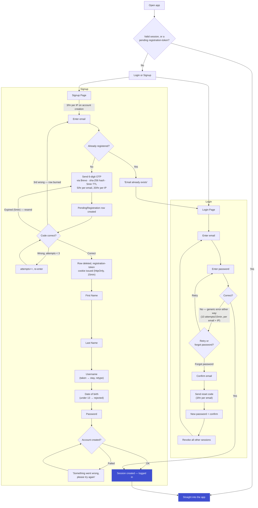

# Authentication — ChatSphere Login & Signup

Login and Signup are two separate pages (not a single "one door" email screen). Signup checks if the email is already registered and sends people to Login instead; Login never reveals whether an email exists at all — same error either way.

---

## 1. Tech Stack

| Layer | What we use |
|---|---|
| **Frontend** | Next.js · `react-toastify` (error/success toasts) |
| **Backend** | Node.js + Express.js · `nodemon` (dev reload) · `concurrently` (run Next.js + Express together) · Node's built-in `crypto` (OTP generation) |
| **Database** | Neon (serverless Postgres) · Drizzle ORM |
| **Email** | Brevo (OTP + reset codes) |
| **Auth** | Better Auth (sessions, password hashing via `scrypt`, rate limiting) |

**Already implemented:** `zod` validates the signup/login form payloads on the server — pairs naturally with Drizzle and keeps field rules (below) enforced in one place instead of copy-pasted per route.

---

## 2. The Flow

### Step by step

**Login:** email + password, checked together. Wrong on either side gives the exact same error — *"the email doesn't exist or the password is wrong"* — so a failed attempt never confirms whether an account exists. Forgot password sends a reset code to the email (if an account exists — same non-committal response), and a successful reset revokes every other active session so a stolen password can't keep a stale session alive elsewhere.

**Signup:** email first. If it's already registered, the user is told and sent to Login — this one screen is allowed to confirm existence, since the user already declared themselves "new." Otherwise a 6-digit OTP goes out (Brevo), and a `PendingRegistration` row holds the hashed code — nothing is written to `User` yet. Once the code checks out, that row is deleted immediately and a short-lived, httpOnly, signed registration-token cookie takes over as proof "this browser verified this email" for the rest of signup (First Name → Last Name → Username → DOB → Password). The `User` row is only written at the very end, in the same transaction that creates the session — so an abandoned signup never leaves a half-built account behind.

---

## 3. Database

| Table | Owner | Key fields |
|---|---|---|
| `pending_registration` | ours | `email` (unique), `otpHash` (sha-256), `attempts`, `expiresAt` (15 min) |
| `user` | Better Auth + ours | `id`, `email` (unique), `emailVerified`, `firstName`, `lastName`, `username` (unique, lowercase), `displayUsername`, `birthDate` |
| `account` | Better Auth | `userId`, `providerId: "credential"`, `password` (scrypt hash) |
| `session` | Better Auth | `token` (opaque, cookie value), `userId`, `expiresAt`, `ipAddress`, `userAgent` |
| `verification` | Better Auth | used for the forgot-password reset code |

Password never lives on `user` — it's on `account`, so a stray `SELECT user.*` can never leak a hash.

---

## 4. Field Rules

| Field | Rule |
|---|---|
| **Email** | Valid format, lowercased, trimmed, unique |
| **First Name** | 1–25 chars, any Unicode, emoji fine, required |
| **Last Name** | 0–25 chars, optional |
| **Username** | 3–30 chars · `a-z`, `0-9`, `.`, `_` only · must start with a letter · must end with a letter or number · stored lowercase (typed case auto-converted) · no spaces, no unicode/emoji · reserved words blocked (`admin`, `root`, `support`, `api`, `system`, `login`, `signup`, etc.) · unique, case-insensitive |
| **Date of birth** | Real date, age ≥ 13 |
| **Password** | 10–128 chars · at least 1 uppercase, 1 lowercase, 1 number · special character optional · no spaces · hashed with `scrypt` via Better Auth |

---

## 5. Errors & Failure States

**Login**
| Scenario | What happens |
|---|---|
| Wrong email or wrong password | Same generic error either way — never reveals which one was wrong |
| 10 failed attempts in 15 min (per email + per IP) | Rate limited, temporary lockout |
| Forgot-password email doesn't exist | Same non-committal "check your email" response as a real account |

**Signup**
| Scenario | What happens |
|---|---|
| Email already registered | "Email already exists" → sent to Login |
| Wrong OTP (attempt 1–2) | attempts++, shown remaining tries |
| Wrong OTP (3rd time) | Row burned/deleted, user sent back to the email step |
| OTP expired (>5 min) | "Code expired," resend option shown |
| Resend requested | Deletes any live OTP and sends a fresh one — counts against the same 5/hr-per-email, 20/hr-per-IP limit |
| Username already taken | Inline error, stays on the same screen, must retype |
| Username fails a format rule | Inline error (reserved word, bad character, etc.) |
| DOB under 13 | Rejected — "You must be at least 13 years old," no account created |
| Account creation fails (server/DB error) | "Something went wrong, please try again," retry allowed |

---

## 6. Rate Limits

| Action | Limit |
|---|---|
| Send signup OTP | 5/hour per email, 20/hour per IP |
| Verify signup OTP | 3 wrong tries burns the code |
| Create account | 3/hour per IP |
| Login (password check) | 10 attempts/15min, per email + per IP |
| Send password-reset code | 3/hour per email |

---

## 7. Future Work — Not Built Yet

**2FA (TOTP).** Opt-in from Settings: confirm current password → scan a QR code → enter a code to prove it works before it's enabled → show 10 backup codes once. After that, login becomes email/password → app code. Build with Better Auth's `twoFactor` plugin — it handles secret generation, encryption at rest, code verification, and backup codes; our side is mostly the Settings UI.

**Device sessions & login alerts.** A Settings screen listing every active session (device, browser, approximate location from IP, last active) with per-device logout and "log out everywhere," plus an email when a login comes from an unrecognized device. Build on top of the `ipAddress`/`userAgent` Better Auth already stores per `session` row — this is mostly UI plus a "is this device known?" check that fires an email via Brevo.

**HIBP breach-password check.** On password set, hash it (SHA-1), send only the first 5 characters to the Have I Been Pwned range API (k-anonymity — the real password/hash never leaves our server), and reject it if the full hash shows up in the ~800 results returned. Build with Better Auth's `haveIBeenPwned` plugin — one line in the plugins array. Should fail open (allow the password) if the HIBP API is down, so a third-party outage never blocks signup.
