# Profile & Settings — Who You Are on ChatSphere

Picks up where [`auth.md`](./auth.md) stops (Step 9: avatar + bio, skippable). Two screens: the public profile (`/u/[username]`) is what others see; Settings (`/settings`) is what only the owner sees — built from a different query than the public one, so a private field can never leak by accident.

---

## 1. Tech Stack

| Layer | What we use |
|---|---|
| **Frontend** | Next.js · `react-easy-crop` (client-side 1:1 avatar crop before upload) · `zod` (same field-rule schemas as the server, per auth.md §1) |
| **Backend** | Node.js + Express.js — same server as auth.md · `multer` (multipart file parsing for the avatar route) · `sharp` (decodes the actual image bytes to check real format + dimensions — never trusts the filename or extension) |
| **Image storage** | Cloudinary — official `cloudinary` SDK for upload, 1:1 crop transform, EXIF strip, and deleting the old asset on replace |
| **Database** | Neon (serverless Postgres) · Drizzle ORM — same instance as auth.md |
| **Rate limiting** | `express-rate-limit` — Better Auth's built-in limiter (auth.md §1) only covers its own routes; these are our own Express routes, so they need their own limiter, same store |

**Worth adding:** nothing extra for bio/HTML safety — React escapes all JSX strings by default, so as long as `bio` is never passed through `dangerouslySetInnerHTML`, XSS is already closed. Same for SQL injection — Drizzle's query builder parameterizes automatically as long as raw `sql` template literals are avoided. Two fewer libraries to install and keep patched.

---

## 2. The Flow

```mermaid
flowchart TD
    subgraph Avatar["Avatar Upload"]
        APick["Pick image"] --> ACrop["Client: crop 1:1"]
        ACrop -->|"POST /api/upload · 10/hr"| ACheck{"sharp: real format<br/>jpg/png/webp, ≤5MB, ≥200×200?"}
        ACheck -->|No| AErr["Rejected"]
        ACheck -->|Yes| ACloud["Cloudinary: crop 1:1, strip EXIF"]
        ACloud --> AStore["Store public_id · delete old asset"]
    end

    subgraph Follow["Follow / Unfollow"]
        FBtn["Click Follow"] -->|"POST /follow · 60/hr"| FCheck{"'Who can follow me'<br/>toggle allows it?"}
        FCheck -->|No| FErr["403"]
        FCheck -->|Yes| FInsert["Insert (followerId, followingId)"]
        FInsert --> FMutual{"Reverse row<br/>already exists?"}
        FMutual -->|Yes| FFriend["Both users are now 'Friends'"]
        FMutual -->|No| FOneWay["One-way follow"]
    end

    subgraph EmailChange["Change Email"]
        EPass["Confirm password"] --> ENew["Type new email"]
        ENew -->|"3/hr"| EOtp["OTP to the NEW address<br/>3 attempts, 5min TTL"]
        EOtp --> ECorrect{"Correct?"}
        ECorrect -->|Yes| EDone["Email updated · OLD address alerted<br/>· all other sessions revoked"]
        ECorrect -->|"3rd wrong"| EBurn["Pending change burned, restart"]
    end

    subgraph Delete["Delete Account"]
        DPass["Confirm password"] --> DUser["Type username to confirm"]
        DUser -->|"3/day"| DSchedule["deletionScheduledAt = now + 30 days<br/>account hidden during the wait"]
        DSchedule --> DWait{"Logs in within 30 days?"}
        DWait -->|Yes| DCancel["Cancelled, one step"]
        DWait -->|No| DPurge["Nightly job anonymizes the profile,<br/>message TEXT kept as 'Deleted User'"]
    end
```

Everyday fields (first name, last name, bio, social links) skip this diagram entirely — one `PATCH /api/me`, no branches, no confirmation step (auth.md-style "why" is the same: low-risk, frequent, shouldn't feel heavy).

---

## 3. Database

| Table | Owner | Key fields |
|---|---|---|
| `user` | Better Auth + ours | `firstName`, `lastName`, `username` (unique, lowercase), `displayUsername`, `bio`, `avatarPublicId`, `usernameChangedAt`, `deactivatedAt`, `deletionScheduledAt` |
| `follow` | ours | `followerId`, `followingId` — composite PK, indexed on both columns |
| `social_link` | ours | `userId`, `platform`, `url` — max 4 rows per user, enforced in the route, not the schema |
| `privacy_settings` | ours | `discoverable`, `canFollow`, `onlineStatus`, `profileDetails` — each `EVERYONE / FRIENDS / NOBODY` |
| `pending_contact_change` | ours | mirrors `pending_registration` (auth.md §3) — `userId`, `type: EMAIL\|PHONE`, `newValue`, `otpHash`, `attempts`, `expiresAt` |

`avatarPublicId` stores a Cloudinary `public_id`, never a full URL — the delivery URL (`w_512,h_512,c_fill,g_face,f_auto,q_auto/<public_id>`) is built at render time, so changing the transform later never requires touching stored data.

---

## 4. Field Rules

| Field | Rule |
|---|---|
| **First Name** | 1–25 chars, any Unicode, emoji fine, required |
| **Last Name** | 0–25 chars, optional |
| **Username** | same rule as auth.md §4, plus: 1 change / 30 days, old handle held 30 days then released |
| **Bio** | 0–250 chars, plain text, no links, rendered escaped — never as HTML |
| **Avatar** | jpg / png / webp, ≤5MB, ≥200×200, cropped 1:1, EXIF stripped |
| **Social Links** | up to 4, any platform, duplicates allowed, must be a valid `http(s)` URL |
| **Email** | same rule as auth.md §4; changing it requires password + OTP to the new address |
| **Phone** | E.164 format, verified via SMS OTP, badge-only — grants no auth power (auth.md §4 rejects SMS as a factor) |

---

## 5. Errors & Failure States

**Avatar Upload**
| Scenario | What happens |
|---|---|
| Wrong file type or a fake extension | Rejected — `sharp` reads the real format from bytes |
| File >5MB or smaller than 200×200 | Rejected, inline error |
| Rate limit exceeded (10/hr) | 429, "try again later" |
| Old Cloudinary asset fails to delete | New avatar still shows; orphan swept by a nightly cleanup job |

**Follow**
| Scenario | What happens |
|---|---|
| Target's "who can follow me" = Nobody | 403, button shows disabled after refresh |
| Already following | No-op, not an error |
| Follows self | Rejected at the route |

**Change Email**
| Scenario | What happens |
|---|---|
| Wrong current password | "Incorrect password," no OTP sent |
| New email already in use | Generic "check your inbox" — no enumeration (auth.md §5) |
| Wrong OTP ×3 | Pending change burned, restart from the password step |
| OTP expired (>5 min) | "Code expired," resend option |

**Delete Account**
| Scenario | What happens |
|---|---|
| Wrong password | Rejected, nothing scheduled |
| Typed username doesn't match | Inline error, stays on screen |
| Logs in during the 30-day window | Deletion silently cancelled |

---

## 6. Rate Limits

| Action | Limit |
|---|---|
| Update profile fields (name, bio, links) | 30/hour per user |
| Change username | 1 / 30 days |
| Avatar upload | 10/hour per user |
| Follow / Unfollow | 60/hour per user |
| Email change: start / verify | 3/hour · 10/hour per user |
| Phone change: start / verify | 3/day · 10/hour per user |
| Confirm-password gate | 5 / 15min per user |
| Schedule deletion | 3/day per user |

---

## 7. Future Work — Not Built Yet

**Deactivate.** A softer alternative to Delete — "hide me for a while," not "delete me." `deactivatedAt = now()` pulls the account out of search and friend suggestions, shows "This account is unavailable" on the profile, and revokes every session, but touches no other row. Logging back in un-hides it instantly, no waiting period. Kept as a separate button from Delete on purpose — merging them is how someone permanently destroys an account they only wanted to hide for a week.

**2FA (TOTP).** Already specced in auth.md §7 — same `twoFactor` Better Auth plugin, same QR-code + backup-codes flow. The only piece that belongs to this document is the Settings entry point (an enable/disable row linking into that flow).

**Private account toggle.** A single account-wide switch that would make Follow require approval — an incoming-request queue, accept/reject actions, existing followers grandfathered in. Deferred because it roughly doubles §2's Follow flow; every account is public and follow is instant for now. Add a `visibility` enum on `user` when this is prioritized.

**Friends-of-friends privacy tier.** Needs a 2-hop query over the `follow` table, which is a real cost at scale — dropped from the three-option privacy toggles (§4) until there's an actual social graph worth querying.

**Automated content moderation.** Bio's "no hate speech / illegal content" rule is enforced by user reports only right now. Automated text moderation (and image moderation on avatars) is reasonable to add once a provider is chosen — no vendor picked yet, so nothing to build against.
