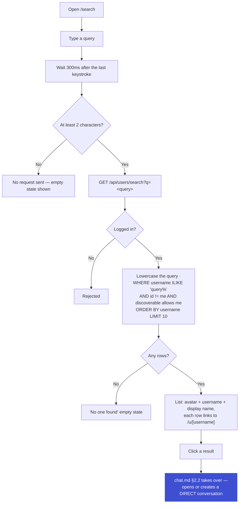

# User Search — Finding People to Message on ChatSphere

Picks up after [`profile.md`](./profile.md). `privacy_settings.discoverable` (profile.md §3) only means something once there's an actual way to find someone — this is that way. It's also the missing piece [`chat.md`](../chat/chat.md) §2.2 already assumes exists: *"Click 'Message' on someone's profile or a search result."* This doc is that search result.

**Scope, on purpose:** this is search-to-message, nothing more — type a username, get a person, click them, land in a DM. Not a browsable people directory, not full-text, not a name search. Small and boring by design; see §7 for what's deliberately left out.

---

## 1. Tech Stack

| Layer | What we use |
|---|---|
| **Frontend** | Next.js · a small debounced-input hook (300ms, no library needed) · reuses the Avatar component from profile.md |
| **Backend** | Node.js + Express.js — same server as auth.md/profile.md · `zod` validates the query param, same pattern as every other route |
| **Database** | Neon (serverless Postgres) · Drizzle ORM — same instance as every other doc, read-only here |
| **Rate limiting** | `express-rate-limit` — same store as profile.md's own routes |

**Already available to build on:** `user.username` is unique (auth.md §3, §4), and a unique constraint already carries a matching index — prefix search doesn't need a new one. `privacy_settings.discoverable` (profile.md §3) is the one gate this whole doc exists to enforce.

---

## 2. The Flow

**Why lowercase both sides before comparing:** the exact same reasoning as auth.md's *"why usernames are stored lowercase"* — `@Naman` and `naman` must match the same row, so the query is lowercased the same way the column already is on write.

**Why this doc stops at "click a result":** what happens next — does a DM already exist, does one get created — is chat.md's job, not this one. Search's only responsibility is turning a typed string into a short list of real, visible-to-you users.

---

## 3. Database

No new tables. This doc reads directly from two tables owned elsewhere:

| Table | Owner | What search reads |
|---|---|---|
| `user` | auth.md §3 | `username`, `firstName`/`lastName`, `avatarPublicId` — the row shown per result |
| `privacy_settings` | profile.md §3 | `discoverable` — the one column that decides whether a row is allowed to appear at all |

---

## 4. Query Rules

| Rule | Value |
|---|---|
| Minimum query length | 2 characters — shorter fires no request at all, not even a debounced one |
| Match type | Prefix only — `ILIKE 'query%'`, lowercased both sides |
| Max results | 10 per request, no pagination (see §7) |
| Excludes | Yourself, and anyone whose `discoverable` setting hides them from you |
| Sort order | Alphabetical by username — simplest deterministic order; no relevance ranking needed at prefix-match scale |

**Why prefix (`'query%'`) and not infix (`'%query%'`):** the prefix form can use the existing username index; the wrap-around form can't and forces a full scan. Same trade-off Instagram makes — searching "nam" finds "naman," not "supernaman."

---

## 5. Errors & Failure States

| Scenario | What happens |
|---|---|
| Query shorter than 2 characters | No request sent — nothing to reject, nothing to rate-limit |
| Not logged in | Rejected server-side |
| Zero matches | "No one found" |
| Every match is hidden by `discoverable` | Same "No one found" — identical wording either way, so a search can never confirm someone exists but has hidden themselves from you |
| Rate limit exceeded | Input briefly disabled, inline "Slow down" message |

---

## 6. Rate Limits

| Action | Limit |
|---|---|
| Search query | 20 / minute per user |

Generous on purpose — the request is read-only and already debounced client-side to roughly 3/second at typing speed. The limit exists only to stop someone from scripting the endpoint directly and hammering the database, not to throttle normal typing.

---

## 7. Future Work — Not Built Yet

**Searching by display name, not just username.** Deferred by this doc's scope (§ intro) — adding it means either a second `ILIKE` branch against `firstName`/`lastName` (cheap, but can't share the username index) or a `pg_trgm` index once prefix-only search stops being enough.

**Recent/saved searches.** An Instagram-style "recently searched" list shown before you type anything. Needs one small table — `recent_search` (`userId`, `searchedUserId`, `searchedAt`) — and a cap (e.g. last 10, de-duplicated on repeat searches).

**Searching your existing conversations.** Typing a name and surfacing an existing DM you already have with them, not just new people to message. This belongs closer to chat.md's sidebar than to this doc — it's filtering conversations you're already in, not discovering new users.

**Online-status dot in results.** Trivial to add later — reuses the exact `privacy_settings.onlineStatus` gate chat.md §2.6 already applies elsewhere, just one more field on the same row. Left out of v1 to keep the first version to the bare minimum: type a query, get usernames, click one.

**A browsable people directory.** A materially different feature from search — pagination, filters, some notion of ranking or "suggested for you." Would earn its own doc rather than growing out of this one.
