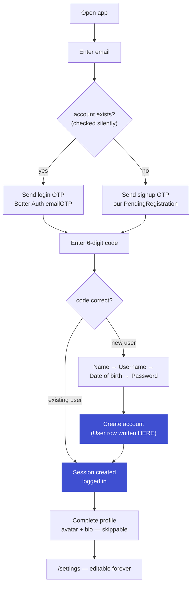
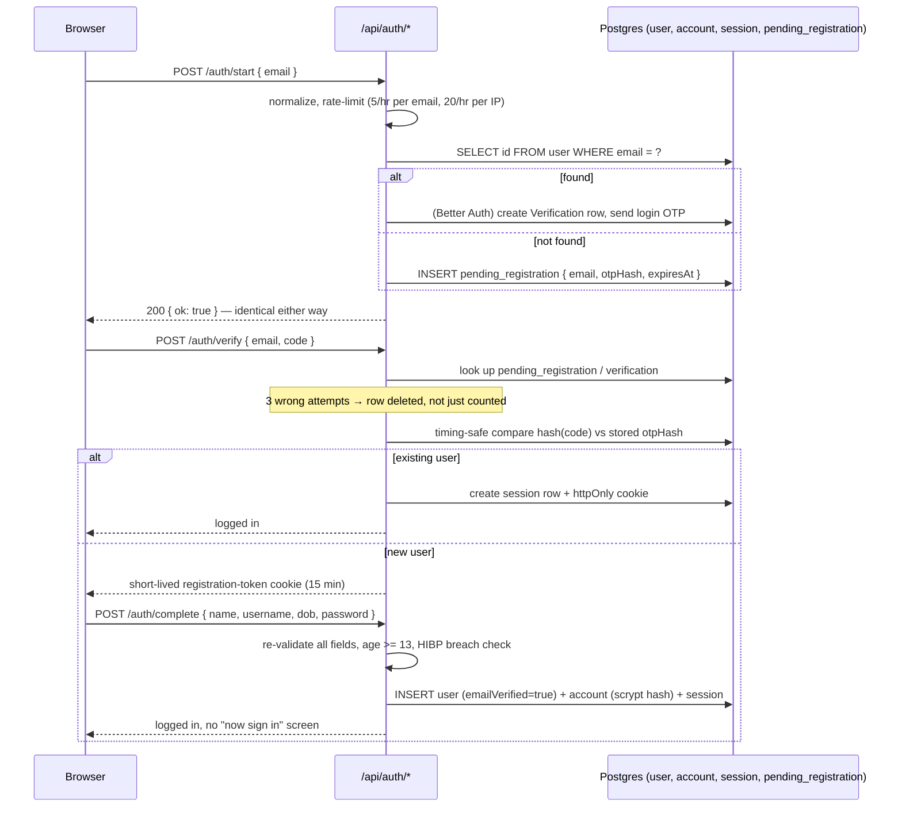
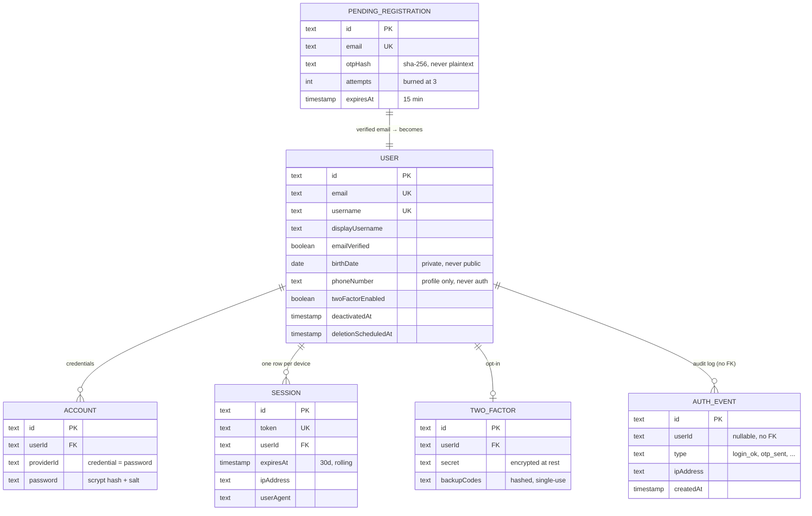
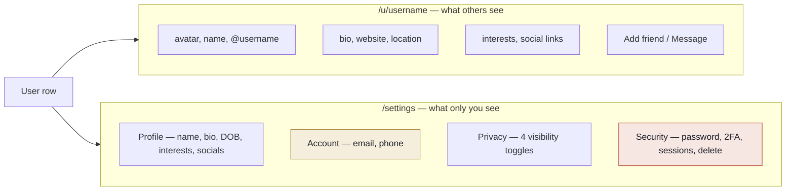
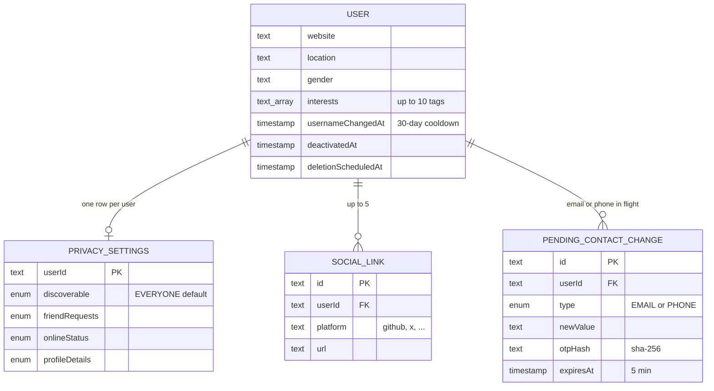
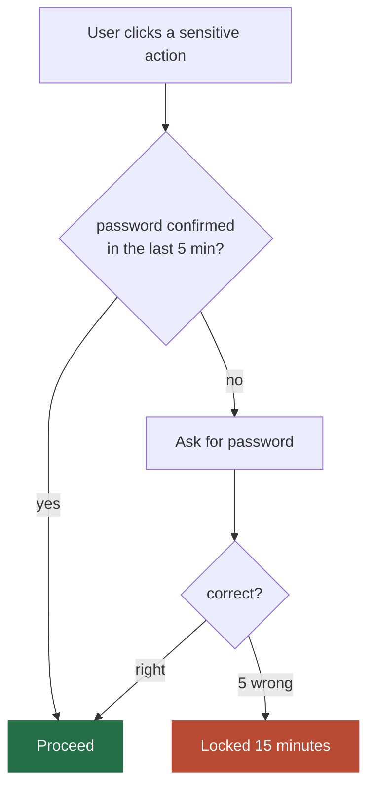
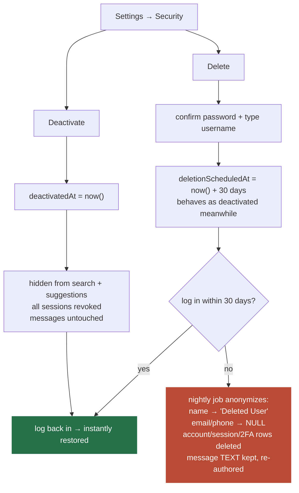

# System Map — Login, Sessions, and Profile Settings

A visual companion to [`auth.md`](./auth.md) and [`profile.md`](./profile.md). Those two documents are the source of truth; this one just draws the pictures. If a diagram here and the prose there ever disagree, the prose wins — update this file.

---

## Table of Contents

1. [The Whole Thing at a Glance](#1-the-whole-thing-at-a-glance)
2. [Login & Signup, Step by Step](#2-login--signup-step-by-step)
3. [The Auth Schema](#3-the-auth-schema)
4. [Three Strength Layers](#4-three-strength-layers)
5. [Profile & Settings Surface](#5-profile--settings-surface)
6. [The Profile Schema](#6-the-profile-schema)
7. [The "Confirm It's You" Gate](#7-the-confirm-its-you-gate)
8. [Deactivate vs. Delete](#8-deactivate-vs-delete)

---

## 1. The Whole Thing at a Glance

Login and signup share one door — the user only ever types an email. The server decides whether that becomes a sign-in or a sign-up, and nothing is ever said aloud about which (auth.md §6, User Enumeration).

The response to "does this account exist" is identical either way, so the flow can't be probed for a user list.

---

## 2. Login & Signup, Step by Step

Three endpoints we own (`/auth/start`, `/auth/verify`, `/auth/complete`); everything else — hashing, sessions, rate limiting, CSRF — is Better Auth (auth.md §2).

**Field rules (server-enforced, auth.md §9):**

| Field | Rule |
|---|---|
| `email` | lowercased, trimmed, unique |
| `username` | 3–20 chars, `a–z 0–9 . _`, reserved-word blocklist |
| `birthDate` | real date, age ≥ 13 |
| `password` | 10–128 chars, no composition rules, breach-checked |

---

## 3. The Auth Schema

One shared Postgres schema — auth tables and app tables in the same `db` object (`db/schema/index.js`), so friend search and profile lookups are plain SQL joins (auth.md §14.2).

`account`, `session`, `two_factor` cascade-delete with the user; `auth_event.userId` deliberately has no FK, so a failed login against an unknown email still gets logged.

**Never stored:** plaintext passwords or OTPs, session tokens in logs or `localStorage`, security questions, unhashed backup codes. If it can be used to *become* the user, it's hashed or it isn't stored at all (auth.md §5).

---

## 4. Three Strength Layers

All three are invisible to a user who never needs them (auth.md §8).

| Layer | When | What happens | Stops |
|---|---|---|---|
| **1 · Breach check** | always on | SHA-1 prefix (5 chars) sent to HIBP's k-anonymity range API; full hash never leaves the server | Credential stuffing — the attack that actually takes accounts |
| **2 · TOTP 2FA** | opt-in | Confirm password → scan QR → type a code to prove it works → 10 backup codes shown once | Password-only takeover; step 3 is non-negotiable to avoid lockouts |
| **3 · Sessions + alerts** | always on | Every session listed (device, browser, IP-location, last active); email on a new device | Doesn't prevent — it's the only layer that *detects* a successful breach |

**Why sessions, not JWTs (auth.md §7):**

| | Database session | JWT |
|---|---|---|
| Revoke one device | instant — delete the row | impossible until expiry |
| Log out everywhere | one `DELETE` | needs a blocklist (= a database) |
| Cost per request | ~1ms, cached 5 min | zero |

The Socket.IO server on `:4000` reads the same `session` table on every handshake — deleting a row disconnects that device's chat socket in the same instant it kills the web session.

---

## 5. Profile & Settings Surface

The same person's data, shown two ways: an **allow-listed** public page, and a settings area split into four tabs by risk (profile.md §2).

The public page is built from an explicit column allow-list; a private field added later stays private by default (profile.md §11).

**Settings tabs, by what they touch:**

| Tab | Gate | Touches |
|---|---|---|
| **Profile** | instant save | Name, bio, website, location, gender, interests, social links. Username: 1 change / 30 days, old handle held 30 days |
| **Account** | password-gated | Change email (password → OTP to new address → alert to old address → revokes other sessions); verify phone (badge only, grants nothing) |
| **Privacy** | enum toggles | Discoverable · friend requests · online status · profile details — each `Everyone / Friends of friends / Friends / Nobody`, enforced server-side |
| **Security** | password-gated | Change password (revokes every other session), 2FA enable/disable + backup codes, device list, logout / logout everywhere / deactivate / delete |

---

## 6. The Profile Schema

Small deltas on top of `user` — new tables only where the data has its own shape (profile.md §10).

`pending_contact_change` mirrors `pending_registration`: a row can be partially invalidated after 3 wrong guesses; a JWT can't.

---

## 7. The "Confirm It's You" Gate

One reusable checkpoint sits in front of every action that could hand over the account (profile.md §9).

| Needs the gate | Skips it |
|---|---|
| Change email · phone · password · 2FA · backup codes · logout everywhere · deactivate · delete | Name, bio, website, location, avatar, gender, interests, socials, privacy toggles, username *(rate-limited instead)* |

The threat this stops isn't a stolen password — the session is already valid. It's an unlocked laptop or an XSS request riding that live session, where the attacker has everything *except* the password.

---

## 8. Deactivate vs. Delete

Two different intentions get two different buttons — merging them is how people destroy an account they only wanted to hide (profile.md §8).

Message text survives anonymization on purpose: deleting it would tear holes in other people's conversations.
