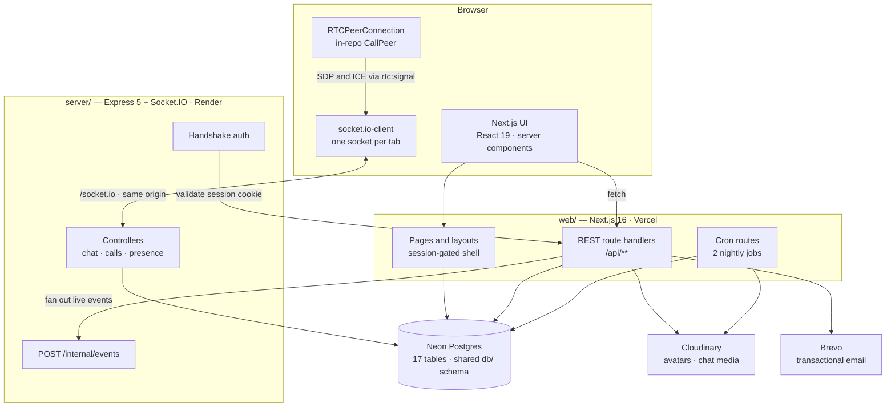
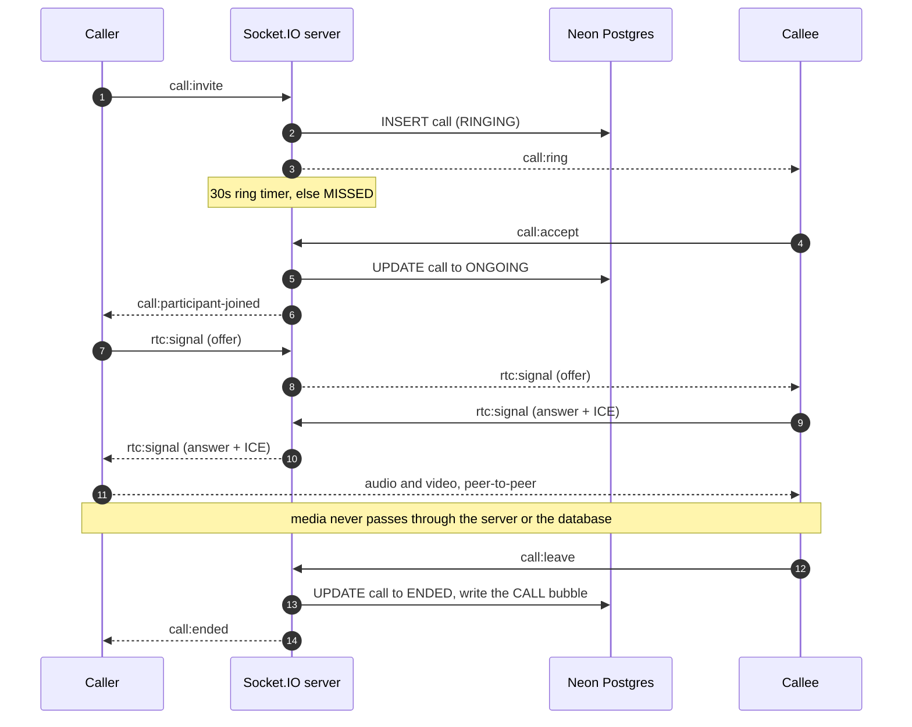

<div align="center">

# Deeperk

**Real-time chat and WebRTC audio/video calling — built as a production-shaped monorepo, not a demo.**

Direct messages and groups with replies, edits, voice notes, media, read receipts, presence
and typing indicators — plus peer-to-peer audio and video calls with ring, busy and
reconnect semantics. Two Node processes, one Postgres database, no realtime SaaS.

<br/>


</div>

---

## Table of contents

- [Screenshots](#-screenshots)
- [Features](#-features)
- [Architecture](#-architecture)
- [Repository layout](#-repository-layout)
- [Tech stack](#-tech-stack)
- [API and realtime surface](#-api-and-realtime-surface)
- [Getting started](#-getting-started)
- [Environment variables](#-environment-variables)
- [Testing](#-testing)
- [Deployment](#-deployment)
- [Project status](#-project-status)
- [Documentation](#-documentation)
- [Contributing](#-contributing)
- [License](#-license)

---

## At a glance

| | |
| --- | --- |
| **Workspaces** | 3 (`web`, `server`, `tests`) + a shared `db/` schema package |
| **Database** | 17 tables, 6 Postgres enums, one Neon connection shared by both processes |
| **HTTP** | 31 REST route handlers, 16 page routes |
| **Realtime** | 17 client→server and 26 server→client Socket.IO events |
| **Tests** | 15 Vitest spec files (177 tests) + 7 Playwright spec files (23 browser tests) |
| **Source** | ~29,000 lines across ~300 files |
| **Third-party realtime** | None — no Pusher, Ably, Firebase or Agora |

---

## 📸 Screenshots

> *Placeholders. Drop four PNGs into [`Docs/images/`](Docs/images) and this table fills in —
> the [capture guide](Docs/images/README.md) says exactly what each shot should contain.*

| | |
| :---: | :---: |
|  |  |
| **Chat** — replies, media, read receipts, typing | **Calls** — peer-to-peer audio/video, group mesh |
|  |  |
| **Voice notes** — record, probe, play back | **Settings** — profile, privacy, notifications |

---

## ✨ Features

### Chat

| Feature | What it does |
| --- | --- |
| **DMs and groups** | Open DMs with anyone discoverable (no friend request gate); groups with `OWNER` / `ADMIN` / `MEMBER` roles, rename, add/remove, leave |
| **Reply, edit, delete** | Quote-replies scoped to the conversation; TEXT edits with an `edited` marker; three-way delete — for me (per-user hide), for everyone (tombstone), or cancel |
| **Forward and multi-select** | Select many messages, forward to another conversation, or copy to clipboard |
| **Mentions** | `@username` autocomplete in groups, highlighted at render time and able to pierce a muted chat — parsed from the body, never stored |
| **Voice notes** | In-browser recorder with a 2-minute cap enforced server-side; duration comes from Cloudinary's probe, not the client's stopwatch |
| **Media** | Images, video and files with magic-byte sniffing before any decoder runs, EXIF stripped, and an HMAC media token so the client can never forge a URL, mime or size |
| **Receipts and presence** | Delivery and read receipts as two per-member watermarks (no receipt table), typing indicators, and online / last-seen — all gated by the sender's privacy settings |
| **Per-chat state** | Pin, timed mute, archive, clear history, delete chat — each stored per member, invisible to the other side |
| **Search** | People search plus in-thread message search with jump-to-message anchoring |
| **Media gallery** | Per-conversation panel of every image, video, file and voice note |
| **Reliability** | Optimistic send with an idempotent outbox (`clientMsgId`), reconnect backfill by cursor, drafts that survive navigation, unread dividers and badges |
| **Notifications** | Toast, sound and title-blink with per-device preferences; per-conversation mute lives in the database so it holds across devices |

### Calls

| Feature | What it does |
| --- | --- |
| **1:1 and group** | Full-mesh audio/video for up to 4 joined participants, one call per conversation |
| **Native WebRTC** | An in-repo `RTCPeerConnection` wrapper — no `simple-peer`, no polyfills. Fixed offer direction (incumbents offer to the newcomer) removes the need for glare handling |
| **Call lifecycle** | Invite, ring, accept, reject, cancel, leave, and join-in-progress, with busy / offline / full pre-checks that answer in constant shapes |
| **Resilience** | 30s ring timeout, 15s disconnect grace nested outside the client's 8s peer grace, state resync on every reconnect, and crash reconciliation on boot |
| **History** | A per-viewer call bubble in the thread, plus a paginated `/calls` feed and per-call detail pages with call-back |
| **Media path** | Audio and video flow **peer-to-peer**. The server relays SDP and ICE only; neither it nor the database ever sees a media frame |

### Accounts, profiles and privacy

| Feature | What it does |
| --- | --- |
| **Custom OTP signup** | Email → 6-digit OTP → profile → password, gated by a signed registration cookie. The `user` row is written only at the final step |
| **Sessions and passwords** | Better Auth for sign-in, password change and OTP password reset; every failed login returns one identical error so account existence never leaks |
| **Profile** | Names, bio, up to four social links, and Cloudinary avatars with a client-side 1:1 crop |
| **Username rules** | One change per 30 days, and the old handle is held for 30 days before it returns to the pool |
| **Email change** | OTP-verified, then every other session is revoked |
| **Deletion** | A 30-day soft schedule that any sign-in cancels; a nightly job then anonymizes the row in place. `user` rows are never hard-deleted |
| **Privacy** | `discoverable`, `onlineStatus` and `profileDetails` gate search, presence and profile reads independently — a hidden field is *absent*, not null |
| **Blocking** | Non-symmetric blocks enforced at DM creation, message send, group invite and search — every gate answers as if the user does not exist |

### Platform

| Feature | What it does |
| --- | --- |
| **Rate limiting** | DB-backed sliding windows on the web side, in-memory on the socket side, keyed per email, per IP and per user |
| **Background jobs** | Two nightly Vercel Cron routes: account anonymization and an orphaned-asset sweep, both fail-closed behind `CRON_SECRET` |
| **UI** | shadcn/ui on Radix, dark-first indigo theme, responsive from a phone tab bar to a desktop rail, container-query layouts, and a global reduced-motion switch |

---

## 📐 Architecture

Two processes share **one Neon Postgres database** through the `db/` package at the repo
root. Next.js owns everything request-shaped — pages, REST, auth, uploads, cron. The
Express + Socket.IO process owns everything *live* — delivery, presence, receipts and call
signaling. They are deliberately separate: serverless functions cannot hold a socket open.



Four things in that picture are non-obvious and worth knowing before you change anything:

- **The socket must be same-origin.** The Better Auth session cookie is host-only, so a
  browser connecting to a different host sends no cookie and every handshake is rejected.
  In production a `/socket.io/:path*` rewrite in [`web/next.config.ts`](web/next.config.ts)
  proxies the socket through the web app's own origin. In development the client talks to
  `:4000` directly.
- **The socket server holds no auth logic.** Its handshake middleware forwards the raw
  cookie header to Next's own `/api/auth/get-session` and trusts the answer. One source of
  truth for sessions, and revoked accounts are rejected at connect time.
- **Rooms decide delivery; the database decides authorization.** Rooms (`user:<id>` and
  `conversation:<id>`) are joined **server-side** from a `conversation_member` query —
  there is no client-emitted join event anywhere — and every handler still re-checks
  membership against Postgres on each event.
- **REST writes reach live clients through a closed-set bridge.** When a Next route
  handler changes something (a new group, a forward, an HTTP-marked read), it posts one of
  exactly seven event kinds to the socket server's secret-gated `/internal/events`, which
  maps each kind to a fixed room and event. It is deliberately not a generic "emit anything
  to anyone" RPC.

### A call, end to end



The full entity-relationship diagram lives in
[`Docs/database/schema.md`](Docs/database/schema.md).

---

## 📁 Repository layout

```
webRTC/
├── web/            Next.js 16 app — every page, every REST route, auth, uploads, cron
├── server/         Express 5 + Socket.IO — message delivery, presence, call signaling
├── db/             Drizzle schema + the single Neon client, shared by both processes
├── tests/          e2e harness — Vitest (API + sockets) and Playwright (browser)
├── Docs/           behavioural specs, schema reference, deployment guide, roadmap
└── drizzle.config.js
```

Each workspace documents itself; this file is the map, not the territory:

| Read this | For |
| --- | --- |
| [`web/README.md`](web/README.md) | The Next.js app: features, per-app env, `src/` structure, house rules |
| [`server/README.md`](server/README.md) | The realtime server: full socket-event catalogue, `src/` tree, load-bearing ordering rules |
| [`tests/README.md`](tests/README.md) | The e2e harness: fixture and cleanup contract, why it is serial, the self-check drill |
| [`Docs/database/schema.md`](Docs/database/schema.md) | Table-by-table schema reference and the ERD |
| [`Docs/deployment/deploy.md`](Docs/deployment/deploy.md) | Step-by-step free-tier deployment |

---

## 🛠 Tech stack

| Layer | Choice | Why |
| --- | --- | --- |
| Web framework | **Next.js 16** (App Router) + **React 19** | Server components by default; client islands only where state demands it |
| Realtime | **Socket.IO 4.8** on **Express 5** | A long-lived connection needs a long-lived process — a serverless function cannot hold one |
| Calls | **Native `RTCPeerConnection`** | `simple-peer` is unmaintained and needs Node polyfills Next 16 does not ship. The in-repo wrapper is ~150 lines |
| Database | **Neon Postgres** + **Drizzle ORM** | Serverless Postgres over HTTP; one schema package imported by both processes |
| Auth | **Better Auth 1.6** | Sessions, sign-in and password flows. Signup itself is custom, because the OTP-gated spec predates it |
| Styling | **Tailwind CSS 4** + **shadcn/ui** (Radix) | CSS-first config, accessible primitives, no component library lock-in |
| Validation | **Zod 4** | One schema per shape, imported verbatim by both client and server |
| Media | **Cloudinary** + **sharp** | Server-side sniffing, transforms and EXIF stripping; delivery URLs built client-safe |
| Email | **Brevo** REST API | Plain `fetch`, no SDK — one checked send that cannot fake success |
| Testing | **Vitest 3** + **Playwright 1.62** | Both run against real servers and the real database; no mocking layer |

---

## 🔌 API and realtime surface

<details>
<summary><b>REST — 31 route handlers under <code>web/src/app/api/</code></b></summary>

<br/>

| Route | Methods | Purpose |
| --- | --- | --- |
| `/api/auth/[...all]` | `GET` `POST` | Better Auth catch-all — sessions, sign-in/out, password reset, username availability |
| `/api/signup/check-email` | `POST` | Step 1 of the custom signup flow |
| `/api/signup/send-otp` | `POST` | Mail a 6-digit code |
| `/api/signup/verify-otp` | `POST` | Verify it and issue the signed registration cookie |
| `/api/signup/complete` | `POST` | Create the `user` row — the only place it happens |
| `/api/me` | `GET` `PATCH` | Own settings bundle and everyday field edits |
| `/api/me/avatar` | `POST` `DELETE` | Upload (sniff → sharp → Cloudinary) and remove |
| `/api/me/username` | `PATCH` | Change with the 30-day cooldown and old-handle hold |
| `/api/me/privacy` | `GET` `PATCH` | Discoverability, online status, profile details |
| `/api/me/email/start` · `/verify` | `POST` | OTP-verified email change |
| `/api/me/delete` | `POST` | Schedule deletion 30 days out |
| `/api/users/search` | `GET` | Prefix search, discoverability- and block-gated |
| `/api/users/[username]` | `GET` | Public profile, privacy-gated field by field |
| `/api/users/[username]/block` | `POST` `DELETE` | Block and unblock |
| `/api/conversations` | `GET` | The sidebar feed — pinned first, then a keyset page |
| `/api/conversations/direct` | `POST` | Open or reuse a DM |
| `/api/conversations/group` | `POST` | Create a group |
| `/api/conversations/[id]` | `GET` `PATCH` `DELETE` | Detail, rename, per-user clear/delete |
| `/api/conversations/[id]/state` | `PATCH` | Pin, mute, archive |
| `/api/conversations/[id]/read` | `POST` | Mark read over HTTP |
| `/api/conversations/[id]/messages` | `GET` | History — cursor pages, `after=` backfill, `around=` / `aroundId=` anchors |
| `/api/conversations/[id]/messages/search` | `GET` | In-thread search |
| `/api/conversations/[id]/media` | `GET` | The media gallery feed |
| `/api/conversations/[id]/forward` | `POST` | Forward selected messages |
| `/api/conversations/[id]/members` | `POST` | Add members |
| `/api/conversations/[id]/members/[userId]` | `PATCH` `DELETE` | Role change, remove, leave |
| `/api/upload/chat-media` | `POST` | Sniff, upload, and mint the signed media token |
| `/api/calls` | `GET` | Paginated cross-conversation call history |
| `/api/cron/anonymize-accounts` | `GET` | Nightly, 03:00 UTC, `CRON_SECRET`-gated |
| `/api/cron/sweep-avatars` | `GET` | Nightly, 05:00 UTC, `CRON_SECRET`-gated |

</details>

<details>
<summary><b>Socket.IO — 17 client→server and 26 server→client events</b></summary>

<br/>

| Direction | Domain | Events |
| --- | --- | --- |
| C→S | Messaging | `message:send` · `message:edit` · `message:delete` · `message:delete-for-me` |
| C→S | Receipts / typing | `conversation:read` · `conversation:delivered` · `typing:start` · `typing:stop` |
| C→S | Calls | `call:invite` · `call:accept` · `call:join` · `call:cancel` · `call:reject` · `call:leave` · `call:state` · `call:mute-state` · `rtc:signal` |
| S→C | Messaging | `message:new` · `message:edited` · `message:deleted` · `message:hidden` |
| S→C | Receipts | `conversation:read-by` · `conversation:read-sync` · `conversation:delivered` · `conversation:self-changed` |
| S→C | Conversations | `conversation:added` · `conversation:removed` · `conversation:updated` |
| S→C | Presence | `session:ready` · `presence:online` · `presence:offline` · `presence:snapshot` · `typing:start` · `typing:stop` |
| S→C | Calls | `call:ring` · `call:ring-cancelled` · `call:ring-handled` · `call:started` · `call:participant-joined` · `call:participant-left` · `call:ended` · `rtc:signal` · `call:mute-state` |

Failure acks are always the flat shape `{ ok: false, code, error }`. The message payload is
an 18-field contract mirrored **by hand** between server and client, and pinned by
`tests/specs/00-contracts.spec.ts`.

The web app also reaches the socket server over HTTP through
`POST /internal/events` — a secret-gated bridge accepting exactly seven event kinds
(`conversation.created`, `members.added`, `members.removed`, `conversation.updated`,
`conversation.read`, `message.created`, `conversation.self-changed`). Full tables in
[`server/README.md`](server/README.md#-socket-events).

</details>

---

## 🚀 Getting started

**Prerequisites**

- **Node.js 20+** (developed on 22; the socket server uses Node's built-in `--env-file`)
- A **Neon Postgres** database — the free tier is plenty
- Optional: **Brevo** and **Cloudinary** accounts for email and media

Missing optional credentials degrade politely rather than crash: without Cloudinary, avatar
upload answers `503`; without Brevo, OTP emails answer `502`. Everything else works.

```bash
# 1. Clone and install — from the REPO ROOT.
#    This is an npm workspaces monorepo and both apps import ../db,
#    so a per-workspace install misses half the code.
git clone https://github.com/Naman830/webRTC.git
cd webRTC
npm install

# 2. Configure. One example file feeds three env files — see the table below
#    for which variable belongs where.
cp -n .env.example .env            # repo root: DATABASE_URL, for Drizzle Kit
cp -n .env.example web/.env.local  # then trim to the web section
cp -n .env.example server/.env     # then trim to the server section

# 3. Create the schema in your Neon database (first run only).
#    There is no npm script for this on purpose — it writes to a live database.
npx drizzle-kit push

# 4. Run both processes together.
npm run dev
```

Then check both halves are up:

| Check | Expect |
| --- | --- |
| <http://localhost:3000> | The login page (or `/chats` if you already have a session) |
| `curl http://localhost:4000/healthz` | `{ "ok": true, "bootId": "…", "uptime": … }` |

To see chat and calls actually work, sign up two accounts and open one in a normal window
and one in a private window.

### Scripts

Run from the repo root unless noted.

| Script | What it does |
| --- | --- |
| `npm run dev` | Both processes at once — Next on `:3000`, Socket.IO on `:4000` |
| `npm test` | The Vitest e2e suite (needs `npm run dev` already running) |
| `npm run test:watch` | The same suite in watch mode |
| `npm run test:browser` | The Playwright browser suite |
| `npx drizzle-kit push` | Apply `db/schema/` to the database — **writes to the live database** |
| `npx drizzle-kit generate` | Emit the SQL a push *would* run, for review |
| `npm run dev -w web` · `build` · `start` · `lint` | The Next app alone |
| `npm run dev -w server` · `start` | The socket server alone |

---

## 🔧 Environment variables

Every name and a placeholder value lives in [`.env.example`](.env.example). That single
file feeds three real files — the column below says which. Never commit real values.

| Variable | Goes in | Required | Purpose |
| --- | --- | :---: | --- |
| `DATABASE_URL` | all three | ✅ | Neon connection string. Must be **identical** everywhere — one database, two processes, one CLI |
| `BETTER_AUTH_SECRET` | `web/.env.local` | ✅ | Signs sessions and the registration cookie. `openssl rand -hex 32` |
| `BETTER_AUTH_URL` | `web/.env.local` | ✅ | The app's own origin |
| `NEXT_PUBLIC_BETTER_AUTH_URL` | `web/.env.local` | ✅ | The same origin, for the browser auth client |
| `MEDIA_SIGNING_SECRET` | `web/.env.local` + `server/.env` | ✅ | Signs chat media tokens. **A mismatch rejects every media message** |
| `INTERNAL_API_SECRET` | `web/.env.local` + `server/.env` | ✅ | Authorizes `POST /internal/events`. **Must match exactly** |
| `NEXT_PUBLIC_SOCKET_URL` | `web/.env.local` | 💬 | Where the browser reaches the socket server in dev |
| `SOCKET_INTERNAL_URL` | `web/.env.local` | 💬 | Server-to-server socket address; setting it also enables the production `/socket.io` rewrite |
| `SOCKET_PORT` | `server/.env` | — | Listen port. Falls back to `PORT`, then `4000` |
| `WEB_ORIGIN` | `server/.env` | — | Comma-separated browser origins allowed by CORS. Never `*` |
| `WEB_INTERNAL_URL` | `server/.env` | — | Where the socket server reaches Next to validate sessions |
| `SOCKET_SINGLE_INSTANCE` | `server/.env` | — | Default `true`. Set `false` **before** running a second socket process — the boot-time presence reset is only correct with one |
| `ICE_SERVERS` | `server/.env` | 📞 | JSON array of STUN/TURN servers. Unset means Google STUN only; malformed JSON refuses to boot |
| `CALL_RING_TIMEOUT_MS` | `server/.env` | — | Ring duration before `MISSED` (default `30000`) |
| `CALL_DISCONNECT_GRACE_MS` | `server/.env` | — | Mid-call reconnect window (default `15000`) |
| `BREVO_API_KEY` | `web/.env.local` | ✉️ | Brevo **REST API** key — starts `xkeysib-`. The same-shaped SMTP key fails with a misleading 401 |
| `BREVO_FROM_EMAIL` | `web/.env.local` | ✉️ | Sender address — must be verified in the Brevo dashboard, or sends fail with a 400 |
| `BREVO_FROM_NAME` | `web/.env.local` | ✉️ | Sender display name |
| `CLOUDINARY_CLOUD_NAME`<br/>`CLOUDINARY_API_KEY`<br/>`CLOUDINARY_API_SECRET` | `web/.env.local` | 🖼 | Server-side upload and destroy. A scoped key needs `create` + `read`, plus Admin API access for the nightly sweep |
| `NEXT_PUBLIC_CLOUDINARY_CLOUD_NAME` | `web/.env.local` | 🖼 | Client-safe copy for building delivery URLs — the cloud name is not a secret |
| `CRON_SECRET` | `web/.env.local` | 🕐 | Authorizes the two `/api/cron/*` routes. Fail-closed: unset refuses every request |
| `TRUSTED_PROXIES` | `web/.env.local` | 🚀 | CIDR list of trusted proxies. Leave unset locally **and on Vercel**; set it when self-hosting behind your own proxy, or every IP-keyed rate limit is bypassable via a client-supplied header |

Legend — ✅ required to boot meaningfully · 💬 chat and calls · 📞 calls across strict NATs ·
✉️ email flows · 🖼 avatars and media · 🕐 cron · 🚀 deploy-time.

Three optional variables (`TEST_EMAIL`, `E2E_WEB_URL`, `E2E_SOCKET_URL`) are read only by
the test harness — pass them on the command line rather than committing them.

---

## 🧪 Testing

There is no mocking layer. Both suites drive the **real** dev servers against the **real**
Neon database, because the bugs worth catching here live in the seams between two
processes — dropped socket events, contract drift, ordering races.

```bash
# terminal 1
npm run dev

# terminal 2
npm test               # Vitest — REST, sockets, the internal bridge, page renders
npm run test:browser   # Playwright — real browser flows, fake mic, real WebRTC
```

| Suite | Files | Tests | Covers |
| --- | :---: | :---: | --- |
| Vitest (`tests/specs/`) | 15 | 177 | Every REST route, every socket event, the internal bridge, rate limits, cron jobs, page renders, and a contract spec pinning the REST and socket message shapes against each other |
| Playwright (`tests/browser/`) | 7 | 23 | Signup, login, chat, voice notes, calls, search, settings and mobile — on desktop and Pixel 7 projects, with a fake microphone and real `RTCPeerConnection` |

The full Vitest run is serial and takes ~4 minutes; the browser suite ~2 minutes.

**Read [`tests/README.md`](tests/README.md) before adding a spec.** Fixture users must carry
the `zz.e2e.` username prefix — cleanup discovers them by that prefix alone, so a fixture
that loses it leaks into the real database permanently. Two specs send real email and only
run when `TEST_EMAIL` is set.

There is no CI yet; running both suites locally is the gate.

---

## 🚢 Deployment

**Status: deploy-ready, not deployed.** There is no public instance. The topology below is
documented and costed, and every piece of it is already exercised in development — but the
deploy itself has not been run.
[`Docs/deployment/deploy.md`](Docs/deployment/deploy.md) is the step-by-step guide.

| Piece | Host | Free tier |
| --- | --- | --- |
| Next.js app + cron | **Vercel** | Hobby — 2 cron jobs/day |
| Socket.IO server | **Render** | Free web service, cold starts accepted |
| Postgres | **Neon** | Free |
| Media | **Cloudinary** | Free |
| Email | **Brevo** | 300 emails/day |

Total: **$0/month**, cold starts and all — a deliberate trade for a portfolio deploy.

**The two footguns**

- Render's start command must be `node server/src/index.js`, **not** `npm start` — the npm
  script's `--env-file=.env` makes Node refuse to boot when the host injects env directly.
  Build from the repo root (`npm ci --omit=dev`), since `server/` requires `../../db`.
- Vercel needs Root Directory `web` **plus** "Include source files outside of the Root
  Directory" enabled, for the same reason.

**Three env prerequisites, all config and no code**

- `CRON_SECRET` on Vercel, or both nightly jobs answer 403 and never run.
- `ICE_SERVERS` on Render with a TURN entry — STUN alone fails for roughly 10–15% of
  strict-NAT networks. Malformed JSON refuses to boot by design.
- `TRUSTED_PROXIES` **unset on Vercel** (it rewrites `x-forwarded-for` itself); set it to
  your proxy's CIDRs on a self-hosted deploy.

One caveat worth stating plainly: through Vercel's rewrite the WebSocket upgrade cannot
pass, so production runs on engine.io long-polling. It degrades gracefully and was accepted
deliberately. Presence is also single-instance by design — scaling the socket server past
one process needs the Redis adapter.

---

## 📌 Project status

Everything in [Features](#-features) is built, pushed and covered by tests. The full build
log, including what was deferred and why, is in [`Docs/roadmap.md`](Docs/roadmap.md).

**Deliberately not built** — each is its own workstream, not a gap:

| Not built | Why |
| --- | --- |
| Message reactions | Built, then held back at the owner's request. Archived as [`Docs/patches/message-reactions.patch`](Docs/patches/message-reactions.patch) |
| Web Push notifications | Needed for missed calls when the tab is closed; requires a service worker and its own design pass |
| Screen sharing, >4-person calls, recording | An SFU changes the call architecture from mesh to server-routed |
| Full-text message search | `ILIKE` prefix search today; `tsvector` + GIN is the upgrade |
| Link-preview unfurling | Needs an SSRF design before it is safe to build |
| End-to-end encryption | Incompatible with server-side search and history as currently specified |
| CI | Both suites need two live servers and a real database; orchestrating that in CI is the documented next step |

---

## 📚 Documentation

Behaviour is specified before it is built. These docs are the source of truth for *what*
the app does:

| Document | Covers |
| --- | --- |
| [`Docs/user/auth.md`](Docs/user/auth.md) | Login and the multi-step OTP signup, field rules, errors, rate limits |
| [`Docs/user/profile.md`](Docs/user/profile.md) | Public profile vs owner settings, privacy tiers, username and email change |
| [`Docs/user/search.md`](Docs/user/search.md) | Prefix search scope and discoverability gating |
| [`Docs/chat/chat.md`](Docs/chat/chat.md) | DMs, groups, receipts, media, voice notes, per-chat state |
| [`Docs/call/call.md`](Docs/call/call.md) | Call lifecycle, limits, and §8.1's as-built deltas |
| [`Docs/database/schema.md`](Docs/database/schema.md) | Table-by-table reference and the ERD |
| [`Docs/database/db-connection.md`](Docs/database/db-connection.md) | How Neon, Drizzle and the schema barrels are wired |
| [`Docs/deployment/deploy.md`](Docs/deployment/deploy.md) | Free-tier deployment, step by step |
| [`Docs/roadmap.md`](Docs/roadmap.md) | The build log and remaining work |

Where a spec and the code disagree about **behaviour**, the spec wins and the difference is
a bug. Where a spec names an **implementation** detail that changed during the build — the
auth and profile docs assume an Express backend with `multer` and `express-rate-limit`,
while the real implementation is Next.js route handlers with the Web `FormData` API and a
database-backed limiter — the code wins.

---

## 🤝 Contributing

Contributions are welcome. [`CONTRIBUTING.md`](CONTRIBUTING.md) covers the four house rules
that fail quietly, how schema changes are applied, the hand-mirrored socket contract, and
what to run before opening a PR.

The short version: install from the repo root, run both suites against a live dev server,
and never hard-delete a `user` row.

---

## 📄 License

[MIT](LICENSE) © 2026 Naman

---

<div align="center">

Built by **Naman** · [github.com/Naman830](https://github.com/Naman830)

</div>
